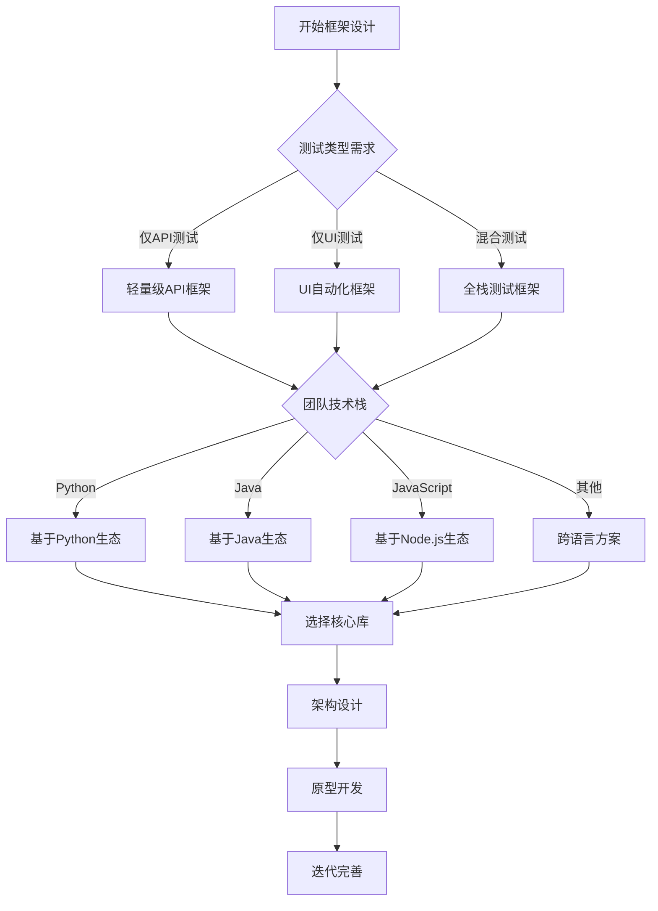

# 自动化测试框架从 0 到 1 完整开发文档

## 📚 文档目录

- [1. 框架概述与设计理念](#1-框架概述与设计理念)
- [2. 技术架构设计](#2-技术架构设计)
- [3. 核心模块详解](#3-核心模块详解)
- [4. 配置系统设计](#4-配置系统设计)
- [5. 用例执行引擎](#5-用例执行引擎)
- [6. 关键字驱动实现](#6-关键字驱动实现)
- [7. 报告与通知系统](#7-报告与通知系统)
- [8. 扩展开发指南](#8-扩展开发指南)
- [9. 性能优化策略](#9-性能优化策略)
- [10. 最佳实践与规范](#10-最佳实践与规范)
- [11. 自定义框架开发指南](#11-自定义框架开发指南)
- [12. 框架演进与维护](#12-框架演进与维护)
- [13. 安全与合规考虑](#13-安全与合规考虑)

---

## 1. 框架概述与设计理念

### 1.1 框架定位

本框架是一个**企业级自动化测试解决方案**，专为现代软件开发团队设计，具备以下核心价值：

```
🎯 业务价值
├── 提升测试效率 - 自动化执行，减少人工成本
├── 保证产品质量 - 全面覆盖，及时发现问题
├── 加速交付周期 - 快速反馈，支持持续集成
└── 降低维护成本 - 关键字驱动，易于维护

🔧 技术价值
├── 统一测试标准 - 规范化测试流程和用例格式
├── 提高代码复用 - 模块化设计，组件可复用
├── 支持团队协作 - 多人并行开发，版本控制友好
└── 便于技术传承 - 文档完善，学习成本低
```

### 1.2 设计原则

#### 1.2.1 SOLID 原则应用

```python
# 单一职责原则 (SRP) - 每个类只负责一个功能
class APIClient:
    """专门负责HTTP请求处理"""
    def send_request(self, method, url, **kwargs):
        pass

class AssertionHelper:
    """专门负责断言验证"""
    def assert_status_code(self, response, expected):
        pass

# 开闭原则 (OCP) - 对扩展开放，对修改关闭
class KeywordBase:
    """关键字基类，支持扩展新关键字"""
    def execute(self, action, params):
        method = getattr(self, f"_{action}", None)
        if method:
            return method(params)
        raise NotImplementedError(f"关键字 {action} 未实现")

# 依赖倒置原则 (DIP) - 依赖抽象而非具体实现
class TestExecutor:
    def __init__(self, data_parser: DataParserInterface):
        self.data_parser = data_parser  # 依赖抽象接口
```

#### 1.2.2 设计模式应用

```python
# 1. 工厂模式 - 创建不同类型的测试执行器
class TestExecutorFactory:
    @staticmethod
    def create_executor(test_type: str):
        if test_type == "api":
            return APITestExecutor()
        elif test_type == "web":
            return WebTestExecutor()
        else:
            raise ValueError(f"不支持的测试类型: {test_type}")

# 2. 策略模式 - 不同的报告生成策略
class ReportStrategy:
    def generate(self, test_results): pass

class AllureReportStrategy(ReportStrategy):
    def generate(self, test_results):
        # Allure报告生成逻辑
        pass

class HTMLReportStrategy(ReportStrategy):
    def generate(self, test_results):
        # HTML报告生成逻辑
        pass

# 3. 观察者模式 - 测试事件通知
class TestEventObserver:
    def on_test_start(self, test_case): pass
    def on_test_end(self, test_case, result): pass

class NotificationObserver(TestEventObserver):
    def on_test_end(self, test_case, result):
        if result.failed:
            self.send_failure_notification(test_case, result)
```

### 1.3 核心特性

#### 1.3.1 关键字驱动架构

```yaml
# 用例编写示例 - 无需编程知识
test_cases:
  - case_name: "用户登录测试"
    steps:
      - action: "send_request"
        params:
          method: "POST"
          url: "/api/login"
          data:
            username: "admin"
            password: "123456"
      - action: "assert_status_code"
        params:
          expected: 200
      - action: "extract_data"
        params:
          name: "token"
          path: "$.data.token"
```

#### 1.3.2 多层配置管理

```
配置层次结构：
├── 核心配置 (config.yaml)
│   ├── 框架基础设置
│   ├── 执行模式配置
│   └── 日志报告配置
├── 环境配置 (environments.yaml)
│   ├── 开发环境配置
│   ├── 测试环境配置
│   └── 生产环境配置
└── 测试设置 (test_settings.yaml)
    ├── 用例筛选规则
    ├── 数据驱动配置
    └── 执行策略设置
```

#### 1.3.3 并发执行引擎

```python
# 智能并发调度
class ConcurrentExecutor:
    def __init__(self):
        self.api_pool = ThreadPoolExecutor(max_workers=4)
        self.web_pool = ThreadPoolExecutor(max_workers=2)

    def execute_tests(self, test_cases):
        # 根据测试类型分配到不同线程池
        api_futures = []
        web_futures = []

        for case in test_cases:
            if case.test_type == "api":
                future = self.api_pool.submit(self.execute_api_test, case)
                api_futures.append(future)
            elif case.test_type == "web":
                future = self.web_pool.submit(self.execute_web_test, case)
                web_futures.append(future)

        # 等待所有测试完成
        return self.collect_results(api_futures + web_futures)
```

---

## 2. 技术架构设计

### 2.1 整体架构图

```
┌─────────────────────────────────────────────────────────────┐
│                    用户交互层 (User Interface)                │
├─────────────────────────────────────────────────────────────┤
│  命令行接口 │  配置文件  │  测试用例文件  │  报告查看器      │
└─────────────────────────────────────────────────────────────┘
                                │
┌─────────────────────────────────────────────────────────────┐
│                    应用服务层 (Application Layer)             │
├─────────────────────────────────────────────────────────────┤
│  TestFrameworkApp │ ArgumentParser │ ReportGenerator │ NotificationSender │
└─────────────────────────────────────────────────────────────┘
                                │
┌─────────────────────────────────────────────────────────────┐
│                    业务逻辑层 (Business Logic Layer)          │
├─────────────────────────────────────────────────────────────┤
│  TestExecutor │ CaseParser │ KeywordEngine │ AssertionEngine │
└─────────────────────────────────────────────────────────────┘
                                │
┌─────────────────────────────────────────────────────────────┐
│                    核心服务层 (Core Service Layer)            │
├─────────────────────────────────────────────────────────────┤
│  APIClient │ WebDriver │ DatabaseHelper │ DataExtractor │ Logger │
└─────────────────────────────────────────────────────────────┘
                                │
┌─────────────────────────────────────────────────────────────┐
│                    基础设施层 (Infrastructure Layer)          │
├─────────────────────────────────────────────────────────────┤
│  ConfigManager │ FileSystem │ NetworkIO │ ProcessManager │ ThreadPool │
└─────────────────────────────────────────────────────────────┘
```

### 2.2 模块依赖关系

```python
# 依赖注入容器设计
class DIContainer:
    def __init__(self):
        self._services = {}
        self._singletons = {}

    def register(self, interface, implementation, singleton=False):
        """注册服务"""
        self._services[interface] = {
            'implementation': implementation,
            'singleton': singleton
        }

    def get(self, interface):
        """获取服务实例"""
        service_info = self._services.get(interface)
        if not service_info:
            raise ValueError(f"服务 {interface} 未注册")

        if service_info['singleton']:
            if interface not in self._singletons:
                self._singletons[interface] = service_info['implementation']()
            return self._singletons[interface]

        return service_info['implementation']()

# 服务注册
container = DIContainer()
container.register('config_manager', UnifiedConfigManager, singleton=True)
container.register('logger', Logger, singleton=True)
container.register('api_client', APIClient)
container.register('web_driver', WebDriver)
```

### 2.3 数据流设计

```
测试执行数据流：
┌─────────────┐    ┌─────────────┐    ┌─────────────┐
│  用例文件    │───▶│  解析器      │───▶│  执行引擎    │
│ (YAML/Excel)│    │ (Parser)    │    │ (Executor)  │
└─────────────┘    └─────────────┘    └─────────────┘
                                              │
┌─────────────┐    ┌─────────────┐    ┌─────────────┐
│  测试报告    │◀───│  结果收集器  │◀───│  关键字引擎  │
│ (Report)    │    │ (Collector) │    │ (Keywords)  │
└─────────────┘    └─────────────┘    └─────────────┘
```

---

## 3. 核心模块详解

### 3.1 配置管理模块 (UnifiedConfigManager)

#### 3.1.1 设计目标

```python
"""
配置管理模块设计目标：
1. 统一配置入口 - 所有配置通过统一接口访问
2. 分层配置管理 - 支持多层配置覆盖
3. 动态配置更新 - 支持配置文件热更新
4. 环境隔离 - 不同环境使用不同配置
5. 配置验证 - 确保配置的正确性和完整性
"""

class UnifiedConfigManager:
    """统一配置管理器 - 框架配置的核心"""

    def __init__(self, config_dir: str = "config"):
        self.config_dir = Path(config_dir)
        self.current_env = os.getenv('ENV', 'dev')
        self._config_cache = {}
        self._file_cache = {}
        self._file_timestamps = {}
        self._lock = threading.RLock()

        # 启动配置文件监控
        self._setup_file_watcher()

        # 加载所有配置文件
        self._load_all_configs()
```

#### 3.1.2 配置加载机制

```python
def _load_all_configs(self):
    """加载所有配置文件"""
    config_files = {
        'main': 'config.yaml',
        'test_settings': 'test_settings.yaml',
        'environments': 'environments.yaml'
    }

    for key, filename in config_files.items():
        file_path = self.config_dir / filename
        if file_path.exists():
            self._load_config_file(key, file_path)
        else:
            logger.warning(f"配置文件不存在: {file_path}")
            self._file_cache[key] = {}

def _load_config_file(self, key: str, file_path: Path):
    """加载单个配置文件"""
    try:
        with open(file_path, 'r', encoding='utf-8') as f:
            config_data = yaml.safe_load(f) or {}

        # 处理环境配置文件
        if key == 'environments':
            for env_name, env_config in config_data.items():
                self._file_cache[f'env_{env_name}'] = env_config
        else:
            self._file_cache[key] = config_data

        # 记录文件时间戳
        self._file_timestamps[str(file_path)] = file_path.stat().st_mtime

        logger.debug(f"配置文件加载成功: {file_path}")

    except Exception as e:
        logger.error(f"配置文件加载失败: {file_path}, 错误: {e}")
        self._file_cache[key] = {}
```

#### 3.1.3 配置合并策略

````python
def get_merged_config(self, env: Optional[str] = None) -> Dict[str, Any]:
    """
    获取合并后的配置
    合并顺序：主配置 -> 测试设置配置 -> 环境配置
    """
    env = env or self.current_env
    cache_key = f"merged:{env}"

    with self._lock:
        if cache_key in self._config_cache:
            return self._config_cache[cache_key]

    # 获取各层配置
    main_config = self._file_cache.get('main', {}).copy()
    test_settings_config = self._file_cache.get('test_settings', {})
    env_config = self._file_cache.get(f'env_{env}', {})

    # 深度合并配置
    merged = self._deep_merge(main_config, test_settings_config)
    merged = self._deep_merge(merged, env_config)

    # 缓存结果
    with self._lock:
        self._config_cache[cache_key] = merged

    return merged

def _deep_merge(self, base: Dict, override: Dict) -> Dict:
    """深度合并字典"""
    result = base.copy()

    for key, value in override.items():
        if key in result and isinstance(result[key], dict) and isinstance(value, dict):
            result[key] = self._deep_merge(result[key], value)
        else:
            result[key] = value

    return result

### 3.2 数据解析模块 (DataParser)

#### 3.2.1 多格式支持设计

```python
class DataParser:
    """数据解析器 - 支持YAML和Excel格式"""

    def __init__(self):
        self.template_parser = TemplateParser()
        self.faker_helper = FakerHelper()

    def parse_yaml(self, file_path: str) -> Dict[str, Any]:
        """解析YAML格式测试用例"""
        try:
            with open(file_path, 'r', encoding='utf-8') as f:
                content = f.read()

            # 处理模板变量
            content = self._process_template_variables(content)

            # 解析YAML
            data = yaml.safe_load(content)

            # 验证数据格式
            if self._validate_test_data(data):
                return data
            else:
                raise ValueError("测试用例格式验证失败")

        except Exception as e:
            logger.error(f"YAML文件解析失败: {file_path}, 错误: {e}")
            return {}

    def parse_excel(self, file_path: str) -> Dict[str, Any]:
        """解析Excel格式测试用例"""
        try:
            workbook = openpyxl.load_workbook(file_path)

            # 解析测试信息工作表
            test_info = self._parse_test_info_sheet(workbook)

            # 解析测试用例工作表
            test_cases = self._parse_test_cases_sheet(workbook)

            return {
                'test_info': test_info,
                'test_cases': test_cases
            }

        except Exception as e:
            logger.error(f"Excel文件解析失败: {file_path}, 错误: {e}")
            return {}
````

#### 3.2.2 模板化用例处理

```python
def _process_template_cases(self, test_data: Dict, case_filter: Dict, file_path: str) -> List[Dict]:
    """处理模板化用例"""
    template_parser = TemplateParser()
    test_cases = test_data.get('test_cases', [])
    all_generated_cases = []

    for case_config in test_cases:
        if isinstance(case_config, dict):
            if 'template' in case_config:
                # 模板化用例生成
                try:
                    generated_cases = template_parser.generate_test_cases(case_config, file_path)
                    all_generated_cases.extend(generated_cases)
                    logger.info(f"模板用例生成成功: {case_config.get('case_name', 'Unknown')}, 生成 {len(generated_cases)} 个用例")
                except Exception as e:
                    logger.error(f"模板用例生成失败: {case_config.get('case_name', 'Unknown')}, 错误: {e}")
            else:
                # 传统用例
                all_generated_cases.append(case_config)

    # 应用过滤条件
    if case_filter:
        all_generated_cases = self._filter_test_cases(all_generated_cases, case_filter)

    return all_generated_cases

def _process_template_variables(self, content: str) -> str:
    """处理模板变量"""
    # 处理Faker变量
    faker_pattern = r'\{\{\s*faker\.(\w+)(?:\(([^)]*)\))?\s*\}\}'

    def replace_faker(match):
        method_name = match.group(1)
        args_str = match.group(2) or ''

        try:
            # 解析参数
            args = []
            kwargs = {}
            if args_str:
                # 简单的参数解析
                for arg in args_str.split(','):
                    arg = arg.strip()
                    if '=' in arg:
                        key, value = arg.split('=', 1)
                        kwargs[key.strip()] = eval(value.strip())
                    else:
                        args.append(eval(arg))

            # 调用Faker方法
            faker_value = self.faker_helper.generate(method_name, *args, **kwargs)
            return str(faker_value)

        except Exception as e:
            logger.warning(f"Faker变量处理失败: {match.group(0)}, 错误: {e}")
            return match.group(0)

    content = re.sub(faker_pattern, replace_faker, content)

    # 处理环境变量
    env_pattern = r'\{\{\s*env\.(\w+)\s*\}\}'

    def replace_env(match):
        env_var = match.group(1)
        return os.getenv(env_var, match.group(0))

    content = re.sub(env_pattern, replace_env, content)

    return content
```

### 3.3 测试执行引擎 (TestExecutor)

#### 3.3.1 执行器架构设计

```python
class TestExecutor:
    """测试执行器 - 框架的执行核心"""

    def __init__(self):
        self.config_manager = unified_config
        self.data_parser = DataParser()
        self.api_keywords = APIKeywords()
        self.web_keywords = WebKeywords()
        self.assertion_helper = AssertionHelper()
        self.data_extractor = DataExtractor()
        self.performance_monitor = PerformanceMonitor()

        # 执行上下文
        self.execution_context = ExecutionContext()

        # 事件监听器
        self.event_listeners = []

    def execute_test_case(self, test_case: Dict[str, Any]) -> TestResult:
        """执行单个测试用例"""
        case_name = test_case.get('case_name', 'Unknown')

        # 创建测试结果对象
        result = TestResult(case_name)

        try:
            # 触发测试开始事件
            self._notify_test_start(test_case)

            # 性能监控开始
            self.performance_monitor.start_monitoring(case_name)

            # 执行测试步骤
            if 'request' in test_case:
                # API测试用例
                result = self._execute_api_test(test_case, result)
            elif 'steps' in test_case:
                # Web测试用例或步骤化API测试
                result = self._execute_step_test(test_case, result)
            else:
                raise ValueError("无效的测试用例格式")

            # 执行断言
            if 'assertions' in test_case:
                self._execute_assertions(test_case['assertions'], result)

            # 数据提取
            if 'extract' in test_case:
                self._execute_extractions(test_case['extract'], result)

            result.status = TestStatus.PASSED

        except Exception as e:
            result.status = TestStatus.FAILED
            result.error_message = str(e)
            result.exception = e
            logger.error(f"测试用例执行失败: {case_name}, 错误: {e}")

        finally:
            # 性能监控结束
            performance_data = self.performance_monitor.stop_monitoring(case_name)
            result.performance_data = performance_data

            # 触发测试结束事件
            self._notify_test_end(test_case, result)

        return result
```

#### 3.3.2 API 测试执行逻辑

```python
def _execute_api_test(self, test_case: Dict, result: TestResult) -> TestResult:
    """执行API测试用例"""
    request_config = test_case['request']

    # 构建请求参数
    method = request_config.get('method', 'GET').upper()
    url = request_config.get('url')
    headers = request_config.get('headers', {})
    params = request_config.get('params', {})
    data = request_config.get('data')
    json_data = request_config.get('json')
    files = request_config.get('files')

    # 处理URL
    if not url.startswith('http'):
        base_url = self.config_manager.get_config('api.base_url', '')
        url = f"{base_url.rstrip('/')}/{url.lstrip('/')}"

    # 处理认证
    auth_config = self.config_manager.get_config('api.auth')
    if auth_config and auth_config.get('enabled'):
        headers.update(self._get_auth_headers(auth_config))

    # 发送请求
    try:
        response = self.api_keywords.send_request(
            method=method,
            url=url,
            headers=headers,
            params=params,
            data=data,
            json=json_data,
            files=files
        )

        # 保存响应到结果
        result.response = response
        result.request_info = {
            'method': method,
            'url': url,
            'headers': headers,
            'params': params,
            'data': data,
            'json': json_data
        }

        logger.info(f"API请求成功: {method} {url}, 状态码: {response.status_code}")

    except Exception as e:
        raise Exception(f"API请求失败: {e}")

    return result

def _execute_step_test(self, test_case: Dict, result: TestResult) -> TestResult:
    """执行步骤化测试用例"""
    steps = test_case.get('steps', [])
    step_results = []

    for i, step in enumerate(steps):
        step_name = step.get('name', f'Step {i+1}')
        action = step.get('action')
        params = step.get('params', {})

        try:
            logger.info(f"执行步骤: {step_name} - {action}")

            # 根据动作类型选择执行器
            if action in ['send_request', 'get', 'post', 'put', 'delete']:
                step_result = self._execute_api_step(action, params)
            elif action in ['navigate', 'click', 'input', 'wait', 'scroll']:
                step_result = self._execute_web_step(action, params)
            else:
                # 尝试从关键字引擎执行
                step_result = self._execute_custom_step(action, params)

            step_results.append({
                'name': step_name,
                'action': action,
                'params': params,
                'result': step_result,
                'status': 'passed'
            })

        except Exception as e:
            step_results.append({
                'name': step_name,
                'action': action,
                'params': params,
                'error': str(e),
                'status': 'failed'
            })
            raise Exception(f"步骤执行失败: {step_name} - {e}")

    result.step_results = step_results
    return result
```

---

## 4. 配置系统设计

### 4.1 分层配置架构

```python
"""
配置系统分层设计：

Layer 1: 默认配置 (框架内置)
├── 基础框架配置
├── 默认超时设置
└── 标准日志格式

Layer 2: 主配置文件 (config.yaml)
├── 框架核心配置
├── 执行模式设置
└── 报告通知配置

Layer 3: 测试设置 (test_settings.yaml)
├── 用例筛选规则
├── 数据驱动配置
└── 执行策略设置

Layer 4: 环境配置 (environments.yaml)
├── 开发环境配置
├── 测试环境配置
└── 生产环境配置

Layer 5: 运行时配置 (命令行参数)
├── 临时覆盖配置
├── 调试模式设置
└── 特殊执行参数
"""

class ConfigurationLayer:
    """配置层抽象基类"""

    def __init__(self, priority: int):
        self.priority = priority  # 优先级，数字越大优先级越高
        self.config_data = {}

    def load_config(self) -> Dict[str, Any]:
        """加载配置数据"""
        raise NotImplementedError

    def get_config(self, key_path: str, default: Any = None) -> Any:
        """获取配置项"""
        return self._get_nested_value(self.config_data, key_path, default)

    def _get_nested_value(self, data: Dict, key_path: str, default: Any) -> Any:
        """获取嵌套字典值"""
        keys = key_path.split('.')
        current = data

        for key in keys:
            if isinstance(current, dict) and key in current:
                current = current[key]
            else:
                return default

        return current

class FileConfigLayer(ConfigurationLayer):
    """文件配置层"""

    def __init__(self, file_path: str, priority: int):
        super().__init__(priority)
        self.file_path = file_path
        self.load_config()

    def load_config(self) -> Dict[str, Any]:
        """从文件加载配置"""
        try:
            with open(self.file_path, 'r', encoding='utf-8') as f:
                self.config_data = yaml.safe_load(f) or {}
            logger.debug(f"配置文件加载成功: {self.file_path}")
        except Exception as e:
            logger.warning(f"配置文件加载失败: {self.file_path}, 错误: {e}")
            self.config_data = {}

        return self.config_data

class EnvironmentConfigLayer(ConfigurationLayer):
    """环境变量配置层"""

    def __init__(self, priority: int):
        super().__init__(priority)
        self.load_config()

    def load_config(self) -> Dict[str, Any]:
        """从环境变量加载配置"""
        env_config = {}

        # 扫描特定前缀的环境变量
        for key, value in os.environ.items():
            if key.startswith('AUTOTEST_'):
                # 转换环境变量名为配置路径
                config_key = key[9:].lower().replace('_', '.')
                env_config[config_key] = self._parse_env_value(value)

        self.config_data = env_config
        return self.config_data

    def _parse_env_value(self, value: str) -> Any:
        """解析环境变量值"""
        # 尝试解析为JSON
        try:
            return json.loads(value)
        except:
            pass

        # 尝试解析为布尔值
        if value.lower() in ('true', 'false'):
            return value.lower() == 'true'

        # 尝试解析为数字
        try:
            if '.' in value:
                return float(value)
            else:
                return int(value)
        except:
            pass

        # 返回字符串
        return value
```

### 4.2 配置验证与校验

```python
class ConfigValidator:
    """配置验证器"""

    def __init__(self):
        self.validation_rules = self._load_validation_rules()

    def validate_config(self, config: Dict[str, Any]) -> Tuple[bool, List[str]]:
        """验证配置的完整性和正确性"""
        errors = []

        # 必需配置项检查
        required_configs = [
            'test_type',
            'execution.concurrent.max_workers',
            'report.type',
            'logging.level'
        ]

        for required_key in required_configs:
            if not self._config_exists(config, required_key):
                errors.append(f"缺少必需配置项: {required_key}")

        # 配置值范围检查
        range_validations = {
            'execution.concurrent.max_workers': (1, 20),
            'execution.concurrent.timeout': (10, 3600),
            'report.keep_last': (1, 100)
        }

        for key, (min_val, max_val) in range_validations.items():
            value = self._get_nested_value(config, key)
            if value is not None:
                if not isinstance(value, (int, float)) or not (min_val <= value <= max_val):
                    errors.append(f"配置项 {key} 值 {value} 超出有效范围 [{min_val}, {max_val}]")

        # 枚举值检查
        enum_validations = {
            'test_type': ['api', 'web', 'both'],
            'report.type': ['allure', 'pytest-html', 'both'],
            'logging.level': ['DEBUG', 'INFO', 'WARNING', 'ERROR']
        }

        for key, valid_values in enum_validations.items():
            value = self._get_nested_value(config, key)
            if value is not None and value not in valid_values:
                errors.append(f"配置项 {key} 值 {value} 不在有效选项中: {valid_values}")

        # 依赖关系检查
        self._validate_dependencies(config, errors)

        return len(errors) == 0, errors

    def _validate_dependencies(self, config: Dict, errors: List[str]):
        """验证配置项之间的依赖关系"""
        # 通知配置依赖检查
        if self._get_nested_value(config, 'notification.enabled'):
            notification_types = self._get_nested_value(config, 'notification.types', [])

            for ntype in notification_types:
                if ntype == 'feishu':
                    webhook = self._get_nested_value(config, 'notification.feishu.webhook')
                    if not webhook:
                        errors.append("启用飞书通知时必须配置 notification.feishu.webhook")

                elif ntype == 'email':
                    email_config = self._get_nested_value(config, 'notification.email', {})
                    required_email_fields = ['smtp_server', 'sender', 'password', 'receivers']

                    for field in required_email_fields:
                        if not email_config.get(field):
                            errors.append(f"启用邮件通知时必须配置 notification.email.{field}")

        # 数据库配置依赖检查
        if self._get_nested_value(config, 'database.enabled'):
            db_config = self._get_nested_value(config, 'database', {})
            required_db_fields = ['host', 'port', 'username', 'password', 'database']

            for field in required_db_fields:
                if not db_config.get(field):
                    errors.append(f"启用数据库时必须配置 database.{field}")
```

---

## 5. 用例执行引擎

### 5.1 并发执行架构

````python
class ConcurrentTestExecutor:
    """并发测试执行器"""

    def __init__(self, config_manager: UnifiedConfigManager):
        self.config_manager = config_manager
        self.api_executor_pool = None
        self.web_executor_pool = None
        self.mixed_executor_pool = None

        # 执行统计
        self.execution_stats = ExecutionStats()

        # 结果收集器
        self.result_collector = ResultCollector()

        # 初始化线程池
        self._initialize_thread_pools()

    def _initialize_thread_pools(self):
        """初始化线程池"""
        concurrent_config = self.config_manager.get_config('execution.concurrent', {})

        if concurrent_config.get('api.enabled', True):
            max_workers = concurrent_config.get('api.max_workers', 3)
            self.api_executor_pool = ThreadPoolExecutor(
                max_workers=max_workers,
                thread_name_prefix='API-Test-'
            )
            logger.info(f"API测试线程池初始化完成，最大工作线程数: {max_workers}")

        if concurrent_config.get('web.enabled', True):
            max_workers = concurrent_config.get('web.max_workers', 2)
            self.web_executor_pool = ThreadPoolExecutor(
                max_workers=max_workers,
                thread_name_prefix='Web-Test-'
            )
            logger.info(f"Web测试线程池初始化完成，最大工作线程数: {max_workers}")

        if concurrent_config.get('mixed.enabled', True):
            max_workers = concurrent_config.get('mixed.max_workers', 4)
            self.mixed_executor_pool = ThreadPoolExecutor(
                max_workers=max_workers,
                thread_name_prefix='Mixed-Test-'
            )
            logger.info(f"混合测试线程池初始化完成，最大工作线程数: {max_workers}")

    def execute_test_cases_concurrent(self, test_cases: List[Dict]) -> List[TestResult]:
        """并发执行测试用例"""
        if not test_cases:
            return []

        # 按测试类型分组
        api_cases, web_cases, mixed_cases = self._group_test_cases(test_cases)

        # 提交任务到对应线程池
        futures = []

        # API测试任务
        if api_cases and self.api_executor_pool:
            api_timeout = self.config_manager.get_config('execution.concurrent.api.timeout', 120)
            for case in api_cases:
                future = self.api_executor_pool.submit(
                    self._execute_single_test_with_timeout, case, api_timeout
                )
                futures.append(future)

        # Web测试任务
        if web_cases and self.web_executor_pool:
            web_timeout = self.config_manager.get_config('execution.concurrent.web.timeout', 300)
            for case in web_cases:
                future = self.web_executor_pool.submit(
                    self._execute_single_test_with_timeout, case, web_timeout
                )
                futures.append(future)

        # 混合测试任务
        if mixed_cases and self.mixed_executor_pool:
            mixed_timeout = self.config_manager.get_config('execution.concurrent.mixed.timeout', 300)
            for case in mixed_cases:
                future = self.mixed_executor_pool.submit(
                    self._execute_single_test_with_timeout, case, mixed_timeout
                )
                futures.append(future)

        # 收集结果
        results = []
        completed_count = 0
        total_count = len(futures)

        logger.info(f"开始并发执行 {total_count} 个测试用例")

        for future in as_completed(futures):
            try:
                result = future.result()
                results.append(result)
                completed_count += 1

                # 实时进度报告
                progress = (completed_count / total_count) * 100
                logger.info(f"测试进度: {completed_count}/{total_count} ({progress:.1f}%)")

            except Exception as e:
                logger.error(f"测试用例执行异常: {e}")
                # 创建失败结果
                error_result = TestResult("Unknown")
                error_result.status = TestStatus.FAILED
                error_result.error_message = str(e)
                results.append(error_result)

        logger.info(f"并发测试执行完成，共执行 {len(results)} 个用例")
        return results

    def _execute_single_test_with_timeout(self, test_case: Dict, timeout: int) -> TestResult:
        """带超时的单个测试执行"""
        case_name = test_case.get('case_name', 'Unknown')

        try:
            # 创建测试执行器实例（每个线程独立）
            executor = TestExecutor()

            # 设置超时
            signal.signal(signal.SIGALRM, self._timeout_handler)
            signal.alarm(timeout)

            try:
                result = executor.execute_test_case(test_case)
                signal.alarm(0)  # 取消超时
                return result

            except TimeoutError:
                logger.error(f"测试用例执行超时: {case_name}, 超时时间: {timeout}秒")
                result = TestResult(case_name)
                result.status = TestStatus.FAILED
                result.error_message = f"测试执行超时 ({timeout}秒)"
                return result

        except Exception as e:
            logger.error(f"测试用例执行异常: {case_name}, 错误: {e}")
            result = TestResult(case_name)
            result.status = TestStatus.FAILED
            result.error_message = str(e)
            return result
        finally:
            signal.alarm(0)  # 确保取消超时

    def _timeout_handler(self, signum, frame):
        """超时处理器"""
        raise TimeoutError("测试执行超时")

    def _group_test_cases(self, test_cases: List[Dict]) -> Tuple[List[Dict], List[Dict], List[Dict]]:
        """按测试类型分组测试用例"""
        api_cases = []
        web_cases = []
        mixed_cases = []

        for case in test_cases:
            test_type = self._determine_test_type(case)

            if test_type == 'api':
                api_cases.append(case)
            elif test_type == 'web':
                web_cases.append(case)
            else:
                mixed_cases.append(case)

        return api_cases, web_cases, mixed_cases

    def _determine_test_type(self, test_case: Dict) -> str:
        """确定测试用例类型"""
        if 'request' in test_case:
            return 'api'
        elif 'steps' in test_case:
            steps = test_case['steps']
            web_actions = ['navigate', 'click', 'input', 'wait', 'scroll', 'screenshot']
            api_actions = ['send_request', 'get', 'post', 'put', 'delete']

            has_web = any(step.get('action') in web_actions for step in steps)
            has_api = any(step.get('action') in api_actions for step in steps)

            if has_web and has_api:
                return 'mixed'
            elif has_web:
                return 'web'
            elif has_api:
                return 'api'

        return 'mixed'  # 默认为混合类型

---

## 6. 关键字驱动实现

### 6.1 关键字引擎架构

```python
class KeywordEngine:
    """关键字驱动引擎 - 框架的核心执行引擎"""

    def __init__(self):
        self.keyword_registry = {}
        self.execution_context = ExecutionContext()
        self.variable_manager = VariableManager()

        # 注册内置关键字
        self._register_builtin_keywords()

        # 加载自定义关键字
        self._load_custom_keywords()

    def _register_builtin_keywords(self):
        """注册内置关键字"""
        # API关键字
        api_keywords = APIKeywords()
        self.register_keyword_class(api_keywords)

        # Web关键字
        web_keywords = WebKeywords()
        self.register_keyword_class(web_keywords)

        # 数据库关键字
        db_keywords = DatabaseKeywords()
        self.register_keyword_class(db_keywords)

        # 工具关键字
        util_keywords = UtilityKeywords()
        self.register_keyword_class(util_keywords)

    def register_keyword_class(self, keyword_class):
        """注册关键字类"""
        class_name = keyword_class.__class__.__name__

        # 获取所有公共方法作为关键字
        for method_name in dir(keyword_class):
            if not method_name.startswith('_') and callable(getattr(keyword_class, method_name)):
                keyword_name = method_name
                self.keyword_registry[keyword_name] = getattr(keyword_class, method_name)
                logger.debug(f"注册关键字: {keyword_name} (来自 {class_name})")

    def execute_keyword(self, keyword_name: str, params: Dict[str, Any]) -> Any:
        """执行关键字"""
        if keyword_name not in self.keyword_registry:
            raise KeywordNotFoundError(f"关键字 '{keyword_name}' 未找到")

        keyword_func = self.keyword_registry[keyword_name]

        try:
            # 处理参数中的变量替换
            processed_params = self.variable_manager.process_variables(params)

            # 记录关键字执行
            logger.info(f"执行关键字: {keyword_name}, 参数: {processed_params}")

            # 执行关键字
            result = keyword_func(**processed_params)

            # 保存执行结果到上下文
            self.execution_context.set_last_result(result)

            return result

        except Exception as e:
            logger.error(f"关键字执行失败: {keyword_name}, 错误: {e}")
            raise KeywordExecutionError(f"关键字 '{keyword_name}' 执行失败: {e}")

class APIKeywords:
    """API测试关键字集合"""

    def __init__(self):
        self.client = APIClient()
        self.assertion_helper = AssertionHelper()
        self.data_extractor = DataExtractor()

    def send_request(self, method: str, url: str, **kwargs) -> requests.Response:
        """发送HTTP请求"""
        return self.client.send_request(method, url, **kwargs)

    def get(self, url: str, **kwargs) -> requests.Response:
        """发送GET请求"""
        return self.send_request('GET', url, **kwargs)

    def post(self, url: str, **kwargs) -> requests.Response:
        """发送POST请求"""
        return self.send_request('POST', url, **kwargs)

    def put(self, url: str, **kwargs) -> requests.Response:
        """发送PUT请求"""
        return self.send_request('PUT', url, **kwargs)

    def delete(self, url: str, **kwargs) -> requests.Response:
        """发送DELETE请求"""
        return self.send_request('DELETE', url, **kwargs)

    def assert_status_code(self, response: requests.Response, expected: int):
        """断言状态码"""
        self.assertion_helper.assert_status_code(response, expected)

    def assert_json_path(self, response: requests.Response, path: str, expected: Any, operator: str = 'equals'):
        """断言JSON路径值"""
        self.assertion_helper.assert_json_path(response, path, expected, operator)

    def extract_json_path(self, response: requests.Response, path: str, variable_name: str):
        """从响应中提取JSON路径值"""
        value = self.data_extractor.extract_json_path(response.json(), path)
        VariableManager().set_variable(variable_name, value)
        return value

    def extract_header(self, response: requests.Response, header_name: str, variable_name: str):
        """从响应头中提取值"""
        value = response.headers.get(header_name)
        VariableManager().set_variable(variable_name, value)
        return value

class WebKeywords:
    """Web测试关键字集合"""

    def __init__(self):
        self.browser_manager = BrowserManager()
        self.page = None

    def open_browser(self, browser_type: str = 'chromium', headless: bool = False):
        """打开浏览器"""
        self.page = self.browser_manager.create_page(browser_type, headless)
        return self.page

    def navigate(self, url: str):
        """导航到指定URL"""
        if not self.page:
            self.open_browser()

        self.page.goto(url)
        logger.info(f"导航到: {url}")

    def click(self, locator: str, timeout: int = 30000):
        """点击元素"""
        self.page.click(locator, timeout=timeout)
        logger.info(f"点击元素: {locator}")

    def input(self, locator: str, value: str, timeout: int = 30000):
        """输入文本"""
        self.page.fill(locator, value, timeout=timeout)
        logger.info(f"输入文本到 {locator}: {value}")

    def wait_for_element(self, locator: str, timeout: int = 30000):
        """等待元素出现"""
        self.page.wait_for_selector(locator, timeout=timeout)
        logger.info(f"等待元素: {locator}")

    def wait_for_url(self, url_pattern: str, timeout: int = 30000):
        """等待URL匹配"""
        self.page.wait_for_url(url_pattern, timeout=timeout)
        logger.info(f"等待URL: {url_pattern}")

    def screenshot(self, file_path: str = None):
        """截图"""
        if not file_path:
            timestamp = datetime.now().strftime("%Y%m%d_%H%M%S")
            file_path = f"screenshots/screenshot_{timestamp}.png"

        self.page.screenshot(path=file_path)
        logger.info(f"截图保存到: {file_path}")
        return file_path

    def get_text(self, locator: str, variable_name: str = None):
        """获取元素文本"""
        text = self.page.text_content(locator)

        if variable_name:
            VariableManager().set_variable(variable_name, text)

        logger.info(f"获取文本 {locator}: {text}")
        return text

    def assert_element_visible(self, locator: str):
        """断言元素可见"""
        is_visible = self.page.is_visible(locator)
        if not is_visible:
            raise AssertionError(f"元素不可见: {locator}")
        logger.info(f"断言元素可见: {locator}")

    def assert_text_contains(self, locator: str, expected_text: str):
        """断言元素文本包含指定内容"""
        actual_text = self.page.text_content(locator)
        if expected_text not in actual_text:
            raise AssertionError(f"文本断言失败: 期望包含 '{expected_text}', 实际 '{actual_text}'")
        logger.info(f"断言文本包含: {locator} 包含 '{expected_text}'")

    def close_browser(self):
        """关闭浏览器"""
        if self.page:
            self.browser_manager.close_page(self.page)
            self.page = None
        logger.info("浏览器已关闭")

class VariableManager:
    """变量管理器 - 管理测试执行过程中的变量"""

    _instance = None
    _variables = {}

    def __new__(cls):
        if cls._instance is None:
            cls._instance = super().__new__(cls)
        return cls._instance

    def set_variable(self, name: str, value: Any):
        """设置变量"""
        self._variables[name] = value
        logger.debug(f"设置变量: {name} = {value}")

    def get_variable(self, name: str, default: Any = None) -> Any:
        """获取变量"""
        return self._variables.get(name, default)

    def process_variables(self, data: Any) -> Any:
        """处理数据中的变量引用"""
        if isinstance(data, str):
            return self._replace_variables_in_string(data)
        elif isinstance(data, dict):
            return {k: self.process_variables(v) for k, v in data.items()}
        elif isinstance(data, list):
            return [self.process_variables(item) for item in data]
        else:
            return data

    def _replace_variables_in_string(self, text: str) -> str:
        """替换字符串中的变量引用"""
        # 支持 ${variable_name} 格式的变量引用
        pattern = r'\$\{([^}]+)\}'

        def replace_var(match):
            var_name = match.group(1)
            var_value = self.get_variable(var_name)

            if var_value is None:
                logger.warning(f"变量 '{var_name}' 未定义")
                return match.group(0)  # 返回原始字符串

            return str(var_value)

        return re.sub(pattern, replace_var, text)

    def clear_variables(self):
        """清空所有变量"""
        self._variables.clear()
        logger.debug("所有变量已清空")

    def get_all_variables(self) -> Dict[str, Any]:
        """获取所有变量"""
        return self._variables.copy()
````

### 6.2 自定义关键字扩展机制

```python
class CustomKeywordLoader:
    """自定义关键字加载器"""

    def __init__(self, keyword_engine: KeywordEngine):
        self.keyword_engine = keyword_engine
        self.custom_keywords_dir = Path("plugins/keywords")

    def load_custom_keywords(self):
        """加载自定义关键字"""
        if not self.custom_keywords_dir.exists():
            logger.info("自定义关键字目录不存在，跳过加载")
            return

        # 扫描Python文件
        for py_file in self.custom_keywords_dir.glob("*.py"):
            if py_file.name.startswith("__"):
                continue

            try:
                self._load_keyword_module(py_file)
            except Exception as e:
                logger.error(f"加载自定义关键字文件失败: {py_file}, 错误: {e}")

    def _load_keyword_module(self, py_file: Path):
        """加载关键字模块"""
        module_name = py_file.stem
        spec = importlib.util.spec_from_file_location(module_name, py_file)
        module = importlib.util.module_from_spec(spec)

        # 执行模块
        spec.loader.exec_module(module)

        # 查找关键字类
        for attr_name in dir(module):
            attr = getattr(module, attr_name)

            # 检查是否是关键字类
            if (isinstance(attr, type) and
                hasattr(attr, '__keywords__') and
                attr.__keywords__):

                # 实例化并注册关键字类
                keyword_instance = attr()
                self.keyword_engine.register_keyword_class(keyword_instance)
                logger.info(f"加载自定义关键字类: {attr_name} (来自 {py_file})")

# 自定义关键字示例
class BusinessKeywords:
    """业务关键字示例"""
    __keywords__ = True  # 标记为关键字类

    def __init__(self):
        self.api_keywords = APIKeywords()
        self.variable_manager = VariableManager()

    def user_login(self, username: str, password: str) -> Dict[str, Any]:
        """用户登录业务关键字"""
        login_data = {
            "username": username,
            "password": password
        }

        # 发送登录请求
        response = self.api_keywords.post("/api/login", json=login_data)

        # 验证登录成功
        self.api_keywords.assert_status_code(response, 200)
        self.api_keywords.assert_json_path(response, "$.code", 0)

        # 提取token
        token = self.api_keywords.extract_json_path(response, "$.data.token", "auth_token")

        logger.info(f"用户 {username} 登录成功，token: {token}")

        return {
            "username": username,
            "token": token,
            "login_time": datetime.now().isoformat()
        }

    def create_test_data(self, data_type: str, count: int = 1) -> List[Dict]:
        """创建测试数据业务关键字"""
        faker_helper = FakerHelper()
        test_data = []

        for i in range(count):
            if data_type == "user":
                data = {
                    "username": faker_helper.generate("user_name"),
                    "email": faker_helper.generate("email"),
                    "phone": faker_helper.generate("phone_number"),
                    "address": faker_helper.generate("address")
                }
            elif data_type == "product":
                data = {
                    "name": faker_helper.generate("catch_phrase"),
                    "price": faker_helper.generate("random_number", digits=3),
                    "description": faker_helper.generate("text", max_nb_chars=200)
                }
            else:
                raise ValueError(f"不支持的数据类型: {data_type}")

            test_data.append(data)

        # 保存到变量
        self.variable_manager.set_variable(f"test_{data_type}_data", test_data)

        logger.info(f"创建 {count} 条 {data_type} 测试数据")
        return test_data
```

---

## 7. 报告与通知系统

### 7.1 多格式报告生成

```python
class ReportGenerator:
    """报告生成器 - 支持多种报告格式"""

    def __init__(self, config_manager: UnifiedConfigManager):
        self.config_manager = config_manager
        self.report_strategies = {
            'allure': AllureReportStrategy(),
            'pytest-html': PytestHtmlReportStrategy(),
            'json': JsonReportStrategy(),
            'excel': ExcelReportStrategy()
        }

    def generate_reports(self, report_types: List[str], test_results: List[TestResult]):
        """生成指定类型的报告"""
        if not report_types:
            report_types = ['pytest-html']  # 默认报告类型

        generated_reports = []

        for report_type in report_types:
            if report_type in self.report_strategies:
                try:
                    strategy = self.report_strategies[report_type]
                    report_path = strategy.generate(test_results, self.config_manager)
                    generated_reports.append({
                        'type': report_type,
                        'path': report_path,
                        'url': self._get_report_url(report_path)
                    })
                    logger.info(f"{report_type} 报告生成成功: {report_path}")
                except Exception as e:
                    logger.error(f"{report_type} 报告生成失败: {e}")
            else:
                logger.warning(f"不支持的报告类型: {report_type}")

        return generated_reports

    def _get_report_url(self, report_path: str) -> str:
        """获取报告访问URL"""
        # 如果配置了报告服务器，返回完整URL
        report_server = self.config_manager.get_config('report.server_url')
        if report_server:
            relative_path = Path(report_path).relative_to(Path.cwd())
            return f"{report_server.rstrip('/')}/{relative_path}"

        # 否则返回本地文件路径
        return f"file://{Path(report_path).absolute()}"

class AllureReportStrategy:
    """Allure报告生成策略"""

    def generate(self, test_results: List[TestResult], config_manager: UnifiedConfigManager) -> str:
        """生成Allure报告"""
        allure_results_dir = Path("reports/allure-results")
        allure_report_dir = Path("reports/allure-report")

        # 清理旧的结果
        if allure_results_dir.exists():
            shutil.rmtree(allure_results_dir)
        allure_results_dir.mkdir(parents=True, exist_ok=True)

        # 生成Allure结果文件
        for result in test_results:
            self._generate_allure_result_file(result, allure_results_dir)

        # 生成Allure报告
        try:
            subprocess.run([
                'allure', 'generate', str(allure_results_dir),
                '-o', str(allure_report_dir), '--clean'
            ], check=True, capture_output=True, text=True)

            return str(allure_report_dir / "index.html")

        except subprocess.CalledProcessError as e:
            logger.error(f"Allure报告生成失败: {e}")
            raise
        except FileNotFoundError:
            logger.error("Allure命令未找到，请确保已安装Allure")
            raise

    def _generate_allure_result_file(self, result: TestResult, results_dir: Path):
        """生成单个测试结果的Allure文件"""
        test_result = {
            "uuid": str(uuid.uuid4()),
            "name": result.case_name,
            "fullName": result.case_name,
            "status": self._map_status(result.status),
            "start": int(result.start_time.timestamp() * 1000) if result.start_time else None,
            "stop": int(result.end_time.timestamp() * 1000) if result.end_time else None,
            "labels": [
                {"name": "suite", "value": result.suite_name or "Default"},
                {"name": "testClass", "value": result.test_class or "TestCase"},
                {"name": "testMethod", "value": result.case_name}
            ],
            "parameters": [],
            "attachments": []
        }

        # 添加错误信息
        if result.status == TestStatus.FAILED and result.error_message:
            test_result["statusDetails"] = {
                "message": result.error_message,
                "trace": result.exception_traceback if hasattr(result, 'exception_traceback') else ""
            }

        # 添加步骤信息
        if hasattr(result, 'step_results') and result.step_results:
            test_result["steps"] = []
            for step in result.step_results:
                step_data = {
                    "name": step['name'],
                    "status": self._map_status(step['status']),
                    "start": int(time.time() * 1000),
                    "stop": int(time.time() * 1000)
                }
                test_result["steps"].append(step_data)

        # 添加附件（截图等）
        if hasattr(result, 'attachments') and result.attachments:
            for attachment in result.attachments:
                attachment_data = {
                    "name": attachment['name'],
                    "source": attachment['path'],
                    "type": attachment['type']
                }
                test_result["attachments"].append(attachment_data)

        # 写入文件
        result_file = results_dir / f"{test_result['uuid']}-result.json"
        with open(result_file, 'w', encoding='utf-8') as f:
            json.dump(test_result, f, ensure_ascii=False, indent=2)

    def _map_status(self, status) -> str:
        """映射测试状态到Allure状态"""
        status_mapping = {
            TestStatus.PASSED: "passed",
            TestStatus.FAILED: "failed",
            TestStatus.SKIPPED: "skipped",
            "passed": "passed",
            "failed": "failed",
            "skipped": "skipped"
        }
        return status_mapping.get(status, "unknown")

class PytestHtmlReportStrategy:
    """Pytest HTML报告生成策略"""

    def generate(self, test_results: List[TestResult], config_manager: UnifiedConfigManager) -> str:
        """生成Pytest HTML报告"""
        report_dir = Path("reports/html")
        report_dir.mkdir(parents=True, exist_ok=True)

        report_file = report_dir / "report.html"

        # 生成HTML报告内容
        html_content = self._generate_html_content(test_results)

        with open(report_file, 'w', encoding='utf-8') as f:
            f.write(html_content)

        return str(report_file)

    def _generate_html_content(self, test_results: List[TestResult]) -> str:
        """生成HTML报告内容"""
        # 统计信息
        total_count = len(test_results)
        passed_count = sum(1 for r in test_results if r.status == TestStatus.PASSED)
        failed_count = sum(1 for r in test_results if r.status == TestStatus.FAILED)
        skipped_count = sum(1 for r in test_results if r.status == TestStatus.SKIPPED)

        pass_rate = (passed_count / total_count * 100) if total_count > 0 else 0

        # 生成HTML
        html_template = """
        <!DOCTYPE html>
        <html>
        <head>
            <meta charset="UTF-8">
            <title>自动化测试报告</title>
            <style>
                body { font-family: Arial, sans-serif; margin: 20px; }
                .header { background: #f5f5f5; padding: 20px; border-radius: 5px; }
                .summary { display: flex; gap: 20px; margin: 20px 0; }
                .stat-card { background: white; border: 1px solid #ddd; padding: 15px; border-radius: 5px; text-align: center; }
                .passed { border-left: 4px solid #28a745; }
                .failed { border-left: 4px solid #dc3545; }
                .skipped { border-left: 4px solid #ffc107; }
                .total { border-left: 4px solid #007bff; }
                table { width: 100%; border-collapse: collapse; margin-top: 20px; }
                th, td { border: 1px solid #ddd; padding: 8px; text-align: left; }
                th { background-color: #f2f2f2; }
                .status-passed { color: #28a745; font-weight: bold; }
                .status-failed { color: #dc3545; font-weight: bold; }
                .status-skipped { color: #ffc107; font-weight: bold; }
            </style>
        </head>
        <body>
            <div class="header">
                <h1>自动化测试报告</h1>
                <p>生成时间: {timestamp}</p>
                <p>通过率: {pass_rate:.1f}%</p>
            </div>

            <div class="summary">
                <div class="stat-card total">
                    <h3>{total_count}</h3>
                    <p>总计</p>
                </div>
                <div class="stat-card passed">
                    <h3>{passed_count}</h3>
                    <p>通过</p>
                </div>
                <div class="stat-card failed">
                    <h3>{failed_count}</h3>
                    <p>失败</p>
                </div>
                <div class="stat-card skipped">
                    <h3>{skipped_count}</h3>
                    <p>跳过</p>
                </div>
            </div>

            <table>
                <thead>
                    <tr>
                        <th>用例名称</th>
                        <th>状态</th>
                        <th>执行时间</th>
                        <th>错误信息</th>
                    </tr>
                </thead>
                <tbody>
                    {test_rows}
                </tbody>
            </table>
        </body>
        </html>
        """

        # 生成测试用例行
        test_rows = []
        for result in test_results:
            status_class = f"status-{result.status.value.lower()}" if hasattr(result.status, 'value') else f"status-{str(result.status).lower()}"
            duration = ""
            if result.start_time and result.end_time:
                duration = f"{(result.end_time - result.start_time).total_seconds():.2f}s"

            error_msg = result.error_message or ""
            if len(error_msg) > 100:
                error_msg = error_msg[:100] + "..."

            row = f"""
                <tr>
                    <td>{result.case_name}</td>
                    <td class="{status_class}">{result.status}</td>
                    <td>{duration}</td>
                    <td>{error_msg}</td>
                </tr>
            """
            test_rows.append(row)

        return html_template.format(
            timestamp=datetime.now().strftime("%Y-%m-%d %H:%M:%S"),
            pass_rate=pass_rate,
            total_count=total_count,
            passed_count=passed_count,
            failed_count=failed_count,
            skipped_count=skipped_count,
            test_rows="".join(test_rows)
        )
```

### 7.2 智能通知系统

````python
class NotificationSender:
    """智能通知发送器"""

    def __init__(self, config_manager: UnifiedConfigManager):
        self.config_manager = config_manager
        self.notification_strategies = {
            'feishu': FeishuNotificationStrategy(),
            'email': EmailNotificationStrategy(),
            'wechat': WechatNotificationStrategy(),
            'dingtalk': DingtalkNotificationStrategy()
        }

    def send_notifications(self, test_results: List[TestResult], report_info: Dict[str, Any]):
        """发送测试结果通知"""
        notification_config = self.config_manager.get_config('notification', {})

        if not notification_config.get('enabled', False):
            logger.info("通知功能未启用")
            return

        notification_types = notification_config.get('types', [])
        if not notification_types:
            logger.info("未配置通知类型")
            return

        # 生成通知内容
        notification_content = self._generate_notification_content(test_results, report_info)

        # 发送通知
        for ntype in notification_types:
            if ntype in self.notification_strategies:
                try:
                    strategy = self.notification_strategies[ntype]
                    strategy.send(notification_content, notification_config.get(ntype, {}))
                    logger.info(f"{ntype} 通知发送成功")
                except Exception as e:
                    logger.error(f"{ntype} 通知发送失败: {e}")
            else:
                logger.warning(f"不支持的通知类型: {ntype}")

    def _generate_notification_content(self, test_results: List[TestResult], report_info: Dict) -> Dict[str, Any]:
        """生成通知内容"""
        total_count = len(test_results)
        passed_count = sum(1 for r in test_results if r.status == TestStatus.PASSED)
        failed_count = sum(1 for r in test_results if r.status == TestStatus.FAILED)
        skipped_count = sum(1 for r in test_results if r.status == TestStatus.SKIPPED)

        pass_rate = (passed_count / total_count * 100) if total_count > 0 else 0

        # 获取失败用例信息
        failed_cases = [r for r in test_results if r.status == TestStatus.FAILED]
        failed_case_names = [case.case_name for case in failed_cases[:5]]  # 最多显示5个失败用例

        return {
            'title': '自动化测试执行完成',
            'summary': f'总计 {total_count} 个用例，通过 {passed_count} 个，失败 {failed_count} 个，跳过 {skipped_count} 个',
            'pass_rate': pass_rate,
            'total_count': total_count,
            'passed_count': passed_count,
            'failed_count': failed_count,
            'skipped_count': skipped_count,
            'failed_cases': failed_case_names,
            'report_url': report_info.get('url', ''),
            'execution_time': datetime.now().strftime("%Y-%m-%d %H:%M:%S"),
            'status': 'success' if failed_count == 0 else 'failed'
        }

class FeishuNotificationStrategy:
    """飞书通知策略"""

    def send(self, content: Dict[str, Any], config: Dict[str, Any]):
        """发送飞书通知"""
        webhook_url = config.get('webhook')
        if not webhook_url:
            raise ValueError("飞书通知缺少webhook配置")

        # 构建飞书消息卡片
        card_content = self._build_feishu_card(content)

        payload = {
            "msg_type": "interactive",
            "card": card_content
        }

        response = requests.post(webhook_url, json=payload)
        response.raise_for_status()

        result = response.json()
        if result.get('code') != 0:
            raise Exception(f"飞书通知发送失败: {result.get('msg', 'Unknown error')}")

    def _build_feishu_card(self, content: Dict[str, Any]) -> Dict[str, Any]:
        """构建飞书消息卡片"""
        status_color = "green" if content['status'] == 'success' else "red"
        status_text = "✅ 测试通过" if content['status'] == 'success' else "❌ 测试失败"

        card = {
            "config": {
                "wide_screen_mode": True
            },
            "header": {
                "title": {
                    "content": content['title'],
                    "tag": "plain_text"
                },
                "template": status_color
            },
            "elements": [
                {
                    "tag": "div",
                    "text": {
                        "content": f"**{status_text}**\n{content['summary']}",
                        "tag": "lark_md"
                    }
                },
                {
                    "tag": "hr"
                },
                {
                    "tag": "div",
                    "fields": [
                        {
                            "is_short": True,
                            "text": {
                                "content": f"**通过率**\n{content['pass_rate']:.1f}%",
                                "tag": "lark_md"
                            }
                        },
                        {
                            "is_short": True,
                            "text": {
                                "content": f"**执行时间**\n{content['execution_time']}",
                                "tag": "lark_md"
                            }
                        }
                    ]
                }
            ]
        }

        # 添加失败用例信息
        if content['failed_cases']:
            failed_text = "**失败用例:**\n" + "\n".join([f"• {case}" for case in content['failed_cases']])
            if content['failed_count'] > len(content['failed_cases']):
                failed_text += f"\n... 还有 {content['failed_count'] - len(content['failed_cases'])} 个失败用例"

            card["elements"].append({
                "tag": "div",
                "text": {
                    "content": failed_text,
                    "tag": "lark_md"
                }
            })

        # 添加报告链接
        if content['report_url']:
            card["elements"].extend([
                {
                    "tag": "hr"
                },
                {
                    "tag": "action",
                    "actions": [
                        {
                            "tag": "button",
                            "text": {
                                "content": "查看详细报告",
                                "tag": "plain_text"
                            },
                            "url": content['report_url'],
                            "type": "primary"
                        }
                    ]
                }
            ])

        return card

---

## 8. 扩展开发指南

### 8.1 插件系统架构

```python
class PluginSystem:
    """插件系统 - 支持框架功能扩展"""

    def __init__(self):
        self.plugins = {}
        self.hooks = {}
        self.plugin_dir = Path("plugins")

        # 初始化插件钩子
        self._initialize_hooks()

    def _initialize_hooks(self):
        """初始化插件钩子点"""
        self.hooks = {
            'before_test_execution': [],
            'after_test_execution': [],
            'before_case_execution': [],
            'after_case_execution': [],
            'on_test_failure': [],
            'on_test_success': [],
            'before_report_generation': [],
            'after_report_generation': [],
            'custom_assertion': [],
            'custom_data_extraction': []
        }

    def register_plugin(self, plugin_name: str, plugin_instance):
        """注册插件"""
        self.plugins[plugin_name] = plugin_instance

        # 注册插件的钩子方法
        for hook_name in self.hooks.keys():
            if hasattr(plugin_instance, hook_name):
                self.hooks[hook_name].append(getattr(plugin_instance, hook_name))
                logger.info(f"插件 {plugin_name} 注册钩子: {hook_name}")

        logger.info(f"插件注册成功: {plugin_name}")

    def execute_hook(self, hook_name: str, *args, **kwargs):
        """执行钩子"""
        if hook_name not in self.hooks:
            logger.warning(f"未知的钩子: {hook_name}")
            return

        results = []
        for hook_func in self.hooks[hook_name]:
            try:
                result = hook_func(*args, **kwargs)
                results.append(result)
            except Exception as e:
                logger.error(f"钩子执行失败: {hook_name}, 错误: {e}")

        return results

    def load_plugins(self):
        """加载所有插件"""
        if not self.plugin_dir.exists():
            logger.info("插件目录不存在，跳过插件加载")
            return

        # 扫描插件目录
        for plugin_path in self.plugin_dir.iterdir():
            if plugin_path.is_dir() and not plugin_path.name.startswith('__'):
                self._load_plugin_from_directory(plugin_path)

    def _load_plugin_from_directory(self, plugin_path: Path):
        """从目录加载插件"""
        plugin_file = plugin_path / "plugin.py"
        if not plugin_file.exists():
            logger.warning(f"插件目录缺少 plugin.py 文件: {plugin_path}")
            return

        try:
            # 动态导入插件模块
            spec = importlib.util.spec_from_file_location(
                f"plugin_{plugin_path.name}", plugin_file
            )
            module = importlib.util.module_from_spec(spec)
            spec.loader.exec_module(module)

            # 查找插件类
            plugin_class = getattr(module, 'Plugin', None)
            if plugin_class:
                plugin_instance = plugin_class()
                self.register_plugin(plugin_path.name, plugin_instance)
            else:
                logger.warning(f"插件文件缺少 Plugin 类: {plugin_file}")

        except Exception as e:
            logger.error(f"插件加载失败: {plugin_path}, 错误: {e}")

# 插件基类
class PluginBase:
    """插件基类"""

    def __init__(self):
        self.name = self.__class__.__name__
        self.version = "1.0.0"
        self.description = ""

    def before_test_execution(self, test_suite):
        """测试执行前钩子"""
        pass

    def after_test_execution(self, test_suite, results):
        """测试执行后钩子"""
        pass

    def before_case_execution(self, test_case):
        """用例执行前钩子"""
        pass

    def after_case_execution(self, test_case, result):
        """用例执行后钩子"""
        pass

    def on_test_failure(self, test_case, result):
        """测试失败钩子"""
        pass

    def on_test_success(self, test_case, result):
        """测试成功钩子"""
        pass

# 示例插件：性能监控插件
class PerformanceMonitorPlugin(PluginBase):
    """性能监控插件示例"""

    def __init__(self):
        super().__init__()
        self.description = "监控测试执行性能，收集响应时间等指标"
        self.performance_data = {}

    def before_case_execution(self, test_case):
        """记录用例开始时间"""
        case_name = test_case.get('case_name', 'Unknown')
        self.performance_data[case_name] = {
            'start_time': time.time(),
            'memory_start': self._get_memory_usage()
        }

    def after_case_execution(self, test_case, result):
        """记录用例结束时间和性能数据"""
        case_name = test_case.get('case_name', 'Unknown')

        if case_name in self.performance_data:
            end_time = time.time()
            start_data = self.performance_data[case_name]

            performance_metrics = {
                'execution_time': end_time - start_data['start_time'],
                'memory_usage': self._get_memory_usage() - start_data['memory_start'],
                'timestamp': datetime.now().isoformat()
            }

            # 保存性能数据到结果
            if hasattr(result, 'performance_metrics'):
                result.performance_metrics = performance_metrics

            logger.info(f"用例 {case_name} 性能数据: {performance_metrics}")

    def _get_memory_usage(self) -> float:
        """获取当前内存使用量（MB）"""
        import psutil
        process = psutil.Process()
        return process.memory_info().rss / 1024 / 1024

    def after_test_execution(self, test_suite, results):
        """生成性能报告"""
        performance_report = self._generate_performance_report(results)

        # 保存性能报告
        report_file = Path("reports/performance_report.json")
        report_file.parent.mkdir(parents=True, exist_ok=True)

        with open(report_file, 'w', encoding='utf-8') as f:
            json.dump(performance_report, f, ensure_ascii=False, indent=2)

        logger.info(f"性能报告已生成: {report_file}")

    def _generate_performance_report(self, results) -> Dict[str, Any]:
        """生成性能报告"""
        performance_summary = {
            'total_cases': len(results),
            'average_execution_time': 0,
            'slowest_cases': [],
            'fastest_cases': [],
            'memory_usage_stats': {}
        }

        execution_times = []
        memory_usages = []

        for result in results:
            if hasattr(result, 'performance_metrics'):
                metrics = result.performance_metrics
                execution_times.append(metrics['execution_time'])
                memory_usages.append(metrics['memory_usage'])

        if execution_times:
            performance_summary['average_execution_time'] = sum(execution_times) / len(execution_times)
            performance_summary['max_execution_time'] = max(execution_times)
            performance_summary['min_execution_time'] = min(execution_times)

        if memory_usages:
            performance_summary['memory_usage_stats'] = {
                'average': sum(memory_usages) / len(memory_usages),
                'max': max(memory_usages),
                'min': min(memory_usages)
            }

        return performance_summary
````

### 8.2 自定义断言扩展

```python
class CustomAssertionRegistry:
    """自定义断言注册器"""

    def __init__(self):
        self.custom_assertions = {}

    def register_assertion(self, name: str, assertion_func: callable):
        """注册自定义断言"""
        self.custom_assertions[name] = assertion_func
        logger.info(f"注册自定义断言: {name}")

    def execute_assertion(self, assertion_type: str, actual, expected, **kwargs):
        """执行断言"""
        if assertion_type in self.custom_assertions:
            assertion_func = self.custom_assertions[assertion_type]
            return assertion_func(actual, expected, **kwargs)
        else:
            raise ValueError(f"未知的断言类型: {assertion_type}")

# 自定义断言示例
def assert_response_time(actual_time: float, expected_max: float, **kwargs):
    """响应时间断言"""
    if actual_time > expected_max:
        raise AssertionError(f"响应时间超出预期: {actual_time}s > {expected_max}s")
    logger.info(f"响应时间断言通过: {actual_time}s <= {expected_max}s")

def assert_json_schema(actual_data: dict, expected_schema: dict, **kwargs):
    """JSON Schema断言"""
    import jsonschema

    try:
        jsonschema.validate(actual_data, expected_schema)
        logger.info("JSON Schema断言通过")
    except jsonschema.ValidationError as e:
        raise AssertionError(f"JSON Schema验证失败: {e.message}")

def assert_database_record_count(table_name: str, expected_count: int, db_connection, **kwargs):
    """数据库记录数量断言"""
    cursor = db_connection.cursor()
    cursor.execute(f"SELECT COUNT(*) FROM {table_name}")
    actual_count = cursor.fetchone()[0]

    if actual_count != expected_count:
        raise AssertionError(f"数据库记录数量不匹配: 期望 {expected_count}, 实际 {actual_count}")

    logger.info(f"数据库记录数量断言通过: {table_name} 有 {actual_count} 条记录")

# 注册自定义断言
assertion_registry = CustomAssertionRegistry()
assertion_registry.register_assertion('response_time', assert_response_time)
assertion_registry.register_assertion('json_schema', assert_json_schema)
assertion_registry.register_assertion('db_record_count', assert_database_record_count)
```

### 8.3 数据提取器扩展

```python
class CustomDataExtractorRegistry:
    """自定义数据提取器注册器"""

    def __init__(self):
        self.extractors = {}

    def register_extractor(self, name: str, extractor_func: callable):
        """注册自定义数据提取器"""
        self.extractors[name] = extractor_func
        logger.info(f"注册自定义数据提取器: {name}")

    def extract_data(self, extractor_type: str, source_data, extraction_config: dict):
        """执行数据提取"""
        if extractor_type in self.extractors:
            extractor_func = self.extractors[extractor_type]
            return extractor_func(source_data, extraction_config)
        else:
            raise ValueError(f"未知的数据提取器类型: {extractor_type}")

# 自定义数据提取器示例
def extract_xml_xpath(source_data: str, config: dict):
    """XML XPath数据提取器"""
    import xml.etree.ElementTree as ET

    xpath = config.get('xpath')
    if not xpath:
        raise ValueError("XML XPath提取器缺少xpath配置")

    try:
        root = ET.fromstring(source_data)
        elements = root.findall(xpath)

        if config.get('multiple', False):
            return [elem.text for elem in elements]
        else:
            return elements[0].text if elements else None

    except Exception as e:
        logger.error(f"XML XPath提取失败: {e}")
        return None

def extract_csv_column(source_data: str, config: dict):
    """CSV列数据提取器"""
    import csv
    import io

    column_name = config.get('column')
    row_index = config.get('row_index', 0)

    if not column_name:
        raise ValueError("CSV列提取器缺少column配置")

    try:
        csv_reader = csv.DictReader(io.StringIO(source_data))
        rows = list(csv_reader)

        if row_index < len(rows):
            return rows[row_index].get(column_name)
        else:
            logger.warning(f"CSV行索引超出范围: {row_index}")
            return None

    except Exception as e:
        logger.error(f"CSV列提取失败: {e}")
        return None

def extract_image_text_ocr(source_data: bytes, config: dict):
    """图片OCR文本提取器"""
    try:
        import pytesseract
        from PIL import Image
        import io

        # 从字节数据创建图片对象
        image = Image.open(io.BytesIO(source_data))

        # OCR识别
        lang = config.get('language', 'eng')
        text = pytesseract.image_to_string(image, lang=lang)

        # 可选的文本处理
        if config.get('strip_whitespace', True):
            text = text.strip()

        return text

    except ImportError:
        logger.error("OCR功能需要安装 pytesseract 和 Pillow")
        return None
    except Exception as e:
        logger.error(f"OCR文本提取失败: {e}")
        return None

# 注册自定义数据提取器
extractor_registry = CustomDataExtractorRegistry()
extractor_registry.register_extractor('xml_xpath', extract_xml_xpath)
extractor_registry.register_extractor('csv_column', extract_csv_column)
extractor_registry.register_extractor('image_ocr', extract_image_text_ocr)
```

---

## 9. 性能优化策略

### 9.1 执行性能优化

```python
class PerformanceOptimizer:
    """性能优化器 - 提升框架执行效率"""

    def __init__(self):
        self.connection_pools = {}
        self.cache_manager = CacheManager()
        self.resource_monitor = ResourceMonitor()

    def optimize_http_connections(self):
        """优化HTTP连接"""
        # 使用连接池减少连接开销
        session = requests.Session()

        # 配置连接池
        adapter = requests.adapters.HTTPAdapter(
            pool_connections=20,  # 连接池大小
            pool_maxsize=20,      # 最大连接数
            max_retries=3,        # 重试次数
            pool_block=False      # 非阻塞模式
        )

        session.mount('http://', adapter)
        session.mount('https://', adapter)

        # 设置超时
        session.timeout = (5, 30)  # 连接超时5秒，读取超时30秒

        return session

    def optimize_browser_performance(self):
        """优化浏览器性能"""
        browser_args = [
            '--no-sandbox',
            '--disable-dev-shm-usage',
            '--disable-gpu',
            '--disable-extensions',
            '--disable-plugins',
            '--disable-images',  # 禁用图片加载
            '--disable-javascript',  # 可选：禁用JS（如果不需要）
            '--memory-pressure-off',
            '--max_old_space_size=4096'
        ]

        return {
            'headless': True,
            'args': browser_args,
            'viewport': {'width': 1280, 'height': 720}
        }

    def optimize_test_data_loading(self):
        """优化测试数据加载"""
        # 实现数据预加载和缓存
        class DataCache:
            def __init__(self):
                self._cache = {}
                self._timestamps = {}

            def get_test_data(self, file_path: str):
                """获取测试数据（带缓存）"""
                file_mtime = os.path.getmtime(file_path)

                # 检查缓存是否有效
                if (file_path in self._cache and
                    file_path in self._timestamps and
                    self._timestamps[file_path] >= file_mtime):
                    return self._cache[file_path]

                # 加载数据
                with open(file_path, 'r', encoding='utf-8') as f:
                    data = yaml.safe_load(f)

                # 更新缓存
                self._cache[file_path] = data
                self._timestamps[file_path] = file_mtime

                return data

        return DataCache()

class ResourceMonitor:
    """资源监控器"""

    def __init__(self):
        self.start_time = None
        self.peak_memory = 0
        self.cpu_usage_samples = []

    def start_monitoring(self):
        """开始监控"""
        self.start_time = time.time()
        self.peak_memory = 0
        self.cpu_usage_samples = []

        # 启动监控线程
        self.monitoring_thread = threading.Thread(target=self._monitor_resources)
        self.monitoring_thread.daemon = True
        self.monitoring_thread.start()

    def _monitor_resources(self):
        """监控资源使用"""
        import psutil

        while True:
            try:
                # 监控内存使用
                memory_mb = psutil.virtual_memory().used / 1024 / 1024
                self.peak_memory = max(self.peak_memory, memory_mb)

                # 监控CPU使用
                cpu_percent = psutil.cpu_percent(interval=1)
                self.cpu_usage_samples.append(cpu_percent)

                # 保持最近100个样本
                if len(self.cpu_usage_samples) > 100:
                    self.cpu_usage_samples.pop(0)

                time.sleep(5)  # 每5秒采样一次

            except Exception as e:
                logger.error(f"资源监控异常: {e}")
                break

    def get_performance_report(self) -> Dict[str, Any]:
        """获取性能报告"""
        if not self.start_time:
            return {}

        execution_time = time.time() - self.start_time
        avg_cpu = sum(self.cpu_usage_samples) / len(self.cpu_usage_samples) if self.cpu_usage_samples else 0

        return {
            'execution_time': execution_time,
            'peak_memory_mb': self.peak_memory,
            'average_cpu_percent': avg_cpu,
            'cpu_samples_count': len(self.cpu_usage_samples)
        }

class CacheManager:
    """缓存管理器"""

    def __init__(self):
        self.memory_cache = {}
        self.file_cache_dir = Path("temp/cache")
        self.file_cache_dir.mkdir(parents=True, exist_ok=True)

    def get_cached_response(self, cache_key: str) -> Optional[Any]:
        """获取缓存的响应"""
        # 先检查内存缓存
        if cache_key in self.memory_cache:
            cache_data = self.memory_cache[cache_key]
            if not self._is_cache_expired(cache_data):
                return cache_data['data']

        # 检查文件缓存
        cache_file = self.file_cache_dir / f"{cache_key}.json"
        if cache_file.exists():
            try:
                with open(cache_file, 'r', encoding='utf-8') as f:
                    cache_data = json.load(f)

                if not self._is_cache_expired(cache_data):
                    # 加载到内存缓存
                    self.memory_cache[cache_key] = cache_data
                    return cache_data['data']
                else:
                    # 删除过期的文件缓存
                    cache_file.unlink()

            except Exception as e:
                logger.warning(f"读取缓存文件失败: {cache_file}, 错误: {e}")

        return None

    def set_cached_response(self, cache_key: str, data: Any, ttl: int = 3600):
        """设置缓存响应"""
        cache_data = {
            'data': data,
            'timestamp': time.time(),
            'ttl': ttl
        }

        # 保存到内存缓存
        self.memory_cache[cache_key] = cache_data

        # 保存到文件缓存
        cache_file = self.file_cache_dir / f"{cache_key}.json"
        try:
            with open(cache_file, 'w', encoding='utf-8') as f:
                json.dump(cache_data, f, ensure_ascii=False, default=str)
        except Exception as e:
            logger.warning(f"保存缓存文件失败: {cache_file}, 错误: {e}")

    def _is_cache_expired(self, cache_data: Dict) -> bool:
        """检查缓存是否过期"""
        current_time = time.time()
        cache_time = cache_data.get('timestamp', 0)
        ttl = cache_data.get('ttl', 3600)

        return (current_time - cache_time) > ttl

    def clear_cache(self):
        """清空缓存"""
        self.memory_cache.clear()

        # 清空文件缓存
        for cache_file in self.file_cache_dir.glob("*.json"):
            try:
                cache_file.unlink()
            except Exception as e:
                logger.warning(f"删除缓存文件失败: {cache_file}, 错误: {e}")
```

### 9.2 内存优化策略

````python
class MemoryOptimizer:
    """内存优化器"""

    def __init__(self):
        self.large_objects = []
        self.memory_threshold = 500  # MB

    def optimize_test_results_storage(self):
        """优化测试结果存储"""
        # 使用生成器减少内存占用
        def result_generator(results):
            for result in results:
                # 只保留必要的信息
                yield {
                    'case_name': result.case_name,
                    'status': result.status,
                    'error_message': result.error_message[:500] if result.error_message else None,  # 限制错误信息长度
                    'execution_time': getattr(result, 'execution_time', None)
                }

        return result_generator

    def optimize_large_response_handling(self, response_data: Any) -> Any:
        """优化大响应数据处理"""
        if isinstance(response_data, str) and len(response_data) > 1024 * 1024:  # 1MB
            # 对于大文本响应，只保留摘要
            return {
                'type': 'large_text',
                'size': len(response_data),
                'preview': response_data[:1000] + '...' if len(response_data) > 1000 else response_data,
                'hash': hashlib.md5(response_data.encode()).hexdigest()
            }

        elif isinstance(response_data, bytes) and len(response_data) > 1024 * 1024:  # 1MB
            # 对于大二进制响应，只保留元信息
            return {
                'type': 'large_binary',
                'size': len(response_data),
                'hash': hashlib.md5(response_data).hexdigest()
            }

        return response_data

    def monitor_memory_usage(self):
        """监控内存使用"""
        import psutil

        memory_info = psutil.virtual_memory()
        memory_mb = memory_info.used / 1024 / 1024

        if memory_mb > self.memory_threshold:
            logger.warning(f"内存使用过高: {memory_mb:.1f}MB")
            self._trigger_garbage_collection()

    def _trigger_garbage_collection(self):
        """触发垃圾回收"""
        import gc

        # 强制垃圾回收
        collected = gc.collect()
        logger.info(f"垃圾回收完成，回收对象数: {collected}")

        # 清理大对象引用
        self.large_objects.clear()

class DatabaseOptimizer:
    """数据库优化器"""

    def __init__(self):
        self.connection_pool = None
        self.query_cache = {}

    def create_connection_pool(self, db_config: Dict[str, Any]):
        """创建数据库连接池"""
        try:
            import pymysql
            from pymysql.pool import Pool

            self.connection_pool = Pool(
                host=db_config['host'],
                port=db_config['port'],
                user=db_config['username'],
                password=db_config['password'],
                database=db_config['database'],
                charset=db_config.get('charset', 'utf8mb4'),
                max_connections=db_config.get('max_connections', 10),
                blocking=True
            )

            logger.info("数据库连接池创建成功")

        except ImportError:
            logger.error("数据库连接池需要安装 pymysql")
        except Exception as e:
            logger.error(f"数据库连接池创建失败: {e}")

    def execute_query_with_cache(self, query: str, params: tuple = None, cache_ttl: int = 300):
        """执行带缓存的查询"""
        # 生成缓存键
        cache_key = hashlib.md5(f"{query}:{params}".encode()).hexdigest()

        # 检查缓存
        if cache_key in self.query_cache:
            cache_data = self.query_cache[cache_key]
            if time.time() - cache_data['timestamp'] < cache_ttl:
                logger.debug(f"使用缓存查询结果: {cache_key}")
                return cache_data['result']

        # 执行查询
        try:
            connection = self.connection_pool.get_connection()
            cursor = connection.cursor()

            if params:
                cursor.execute(query, params)
            else:
                cursor.execute(query)

            result = cursor.fetchall()

            # 缓存结果
            self.query_cache[cache_key] = {
                'result': result,
                'timestamp': time.time()
            }

            cursor.close()
            connection.close()

            return result

        except Exception as e:
            logger.error(f"数据库查询失败: {e}")
            raise

    def optimize_batch_operations(self, operations: List[Dict]):
        """优化批量操作"""
        # 将操作按类型分组
        grouped_ops = {}
        for op in operations:
            op_type = op.get('type')
            if op_type not in grouped_ops:
                grouped_ops[op_type] = []
            grouped_ops[op_type].append(op)

        # 批量执行相同类型的操作
        results = []
        for op_type, ops in grouped_ops.items():
            if op_type == 'insert':
                results.extend(self._batch_insert(ops))
            elif op_type == 'update':
                results.extend(self._batch_update(ops))
            elif op_type == 'delete':
                results.extend(self._batch_delete(ops))

        return results

    def _batch_insert(self, insert_ops: List[Dict]) -> List[Any]:
        """批量插入"""
        if not insert_ops:
            return []

        # 按表名分组
        tables = {}
        for op in insert_ops:
            table = op['table']
            if table not in tables:
                tables[table] = []
            tables[table].append(op['data'])

        results = []
        for table, data_list in tables.items():
            try:
                connection = self.connection_pool.get_connection()
                cursor = connection.cursor()

                # 构建批量插入SQL
                if data_list:
                    columns = list(data_list[0].keys())
                    placeholders = ', '.join(['%s'] * len(columns))
                    sql = f"INSERT INTO {table} ({', '.join(columns)}) VALUES ({placeholders})"

                    # 准备数据
                    values = [tuple(data[col] for col in columns) for data in data_list]

                    # 执行批量插入
                    cursor.executemany(sql, values)
                    connection.commit()

                    results.append({'table': table, 'inserted': len(values)})

                cursor.close()
                connection.close()

            except Exception as e:
                logger.error(f"批量插入失败: {table}, 错误: {e}")
                results.append({'table': table, 'error': str(e)})

        return results

---

## 10. 最佳实践与规范

### 10.1 代码质量标准

```python
"""
代码质量标准和最佳实践
"""

# 1. 命名规范
class TestCaseNamingConvention:
    """测试用例命名规范"""

    @staticmethod
    def validate_case_name(case_name: str) -> bool:
        """
        验证用例名称是否符合规范

        规范要求：
        - 使用中文描述，清晰表达测试目的
        - 格式：[模块]_[功能]_[场景]_[预期结果]
        - 长度不超过50个字符
        - 不包含特殊字符
        """
        if not case_name:
            return False

        if len(case_name) > 50:
            return False

        # 检查是否包含非法字符
        illegal_chars = ['<', '>', ':', '"', '|', '?', '*', '\\', '/']
        if any(char in case_name for char in illegal_chars):
            return False

        return True

    @staticmethod
    def generate_case_id(case_name: str) -> str:
        """生成用例ID"""
        import hashlib

        # 使用MD5生成唯一ID
        case_id = hashlib.md5(case_name.encode('utf-8')).hexdigest()[:8]
        return f"TC_{case_id.upper()}"

# 2. 错误处理规范
class ErrorHandlingStandards:
    """错误处理标准"""

    @staticmethod
    def handle_api_error(response: requests.Response, context: str = ""):
        """标准API错误处理"""
        try:
            if response.status_code >= 400:
                error_info = {
                    'status_code': response.status_code,
                    'url': response.url,
                    'method': response.request.method,
                    'context': context,
                    'response_text': response.text[:500]  # 限制错误信息长度
                }

                if response.headers.get('content-type', '').startswith('application/json'):
                    try:
                        error_info['response_json'] = response.json()
                    except:
                        pass

                raise APIError(f"API请求失败: {error_info}")

        except requests.exceptions.RequestException as e:
            raise APIError(f"网络请求异常: {e}")

    @staticmethod
    def handle_web_error(page, action: str, locator: str = ""):
        """标准Web错误处理"""
        try:
            # 检查页面是否可用
            if page.is_closed():
                raise WebError("页面已关闭")

            # 等待页面加载完成
            page.wait_for_load_state('networkidle', timeout=30000)

        except Exception as e:
            error_info = {
                'action': action,
                'locator': locator,
                'url': page.url if not page.is_closed() else 'Unknown',
                'error': str(e)
            }

            # 自动截图
            try:
                screenshot_path = f"screenshots/error_{int(time.time())}.png"
                page.screenshot(path=screenshot_path)
                error_info['screenshot'] = screenshot_path
            except:
                pass

            raise WebError(f"Web操作失败: {error_info}")

# 3. 日志记录规范
class LoggingStandards:
    """日志记录标准"""

    @staticmethod
    def log_test_step(step_name: str, action: str, params: Dict = None):
        """记录测试步骤"""
        log_data = {
            'step': step_name,
            'action': action,
            'params': params or {},
            'timestamp': datetime.now().isoformat()
        }

        logger.info(f"执行步骤: {step_name}", extra={'step_data': log_data})

    @staticmethod
    def log_assertion(assertion_type: str, expected: Any, actual: Any, result: bool):
        """记录断言结果"""
        log_data = {
            'assertion_type': assertion_type,
            'expected': expected,
            'actual': actual,
            'result': 'PASS' if result else 'FAIL',
            'timestamp': datetime.now().isoformat()
        }

        if result:
            logger.info(f"断言通过: {assertion_type}", extra={'assertion_data': log_data})
        else:
            logger.error(f"断言失败: {assertion_type}", extra={'assertion_data': log_data})

    @staticmethod
    def log_performance_metric(metric_name: str, value: float, unit: str = ""):
        """记录性能指标"""
        log_data = {
            'metric': metric_name,
            'value': value,
            'unit': unit,
            'timestamp': datetime.now().isoformat()
        }

        logger.info(f"性能指标: {metric_name}={value}{unit}", extra={'performance_data': log_data})

# 4. 测试数据管理规范
class TestDataStandards:
    """测试数据管理标准"""

    @staticmethod
    def validate_test_data_structure(test_data: Dict) -> Tuple[bool, List[str]]:
        """验证测试数据结构"""
        errors = []

        # 必需字段检查
        required_fields = ['test_info', 'test_cases']
        for field in required_fields:
            if field not in test_data:
                errors.append(f"缺少必需字段: {field}")

        # test_info结构检查
        if 'test_info' in test_data:
            test_info = test_data['test_info']
            required_info_fields = ['title', 'description']
            for field in required_info_fields:
                if field not in test_info:
                    errors.append(f"test_info缺少必需字段: {field}")

        # test_cases结构检查
        if 'test_cases' in test_data:
            test_cases = test_data['test_cases']
            if not isinstance(test_cases, list):
                errors.append("test_cases必须是列表类型")
            else:
                for i, case in enumerate(test_cases):
                    if not isinstance(case, dict):
                        errors.append(f"测试用例 {i} 必须是字典类型")
                        continue

                    if 'case_name' not in case:
                        errors.append(f"测试用例 {i} 缺少case_name字段")

        return len(errors) == 0, errors

    @staticmethod
    def sanitize_test_data(data: Any) -> Any:
        """清理测试数据"""
        if isinstance(data, str):
            # 移除敏感信息
            sensitive_patterns = [
                r'password["\']?\s*[:=]\s*["\']?[^"\']*["\']?',
                r'token["\']?\s*[:=]\s*["\']?[^"\']*["\']?',
                r'secret["\']?\s*[:=]\s*["\']?[^"\']*["\']?'
            ]

            for pattern in sensitive_patterns:
                data = re.sub(pattern, lambda m: m.group(0).split('=')[0] + '=***', data, flags=re.IGNORECASE)

            return data

        elif isinstance(data, dict):
            return {k: TestDataStandards.sanitize_test_data(v) for k, v in data.items()}

        elif isinstance(data, list):
            return [TestDataStandards.sanitize_test_data(item) for item in data]

        return data

# 5. 配置管理规范
class ConfigurationStandards:
    """配置管理标准"""

    @staticmethod
    def validate_environment_config(env_config: Dict) -> Tuple[bool, List[str]]:
        """验证环境配置"""
        errors = []

        # API配置验证
        if 'api' in env_config:
            api_config = env_config['api']

            # 检查base_url
            base_url = api_config.get('base_url')
            if not base_url:
                errors.append("API配置缺少base_url")
            elif not (base_url.startswith('http://') or base_url.startswith('https://')):
                errors.append("API base_url必须以http://或https://开头")

            # 检查超时配置
            timeout = api_config.get('timeout')
            if timeout and (not isinstance(timeout, (int, float)) or timeout <= 0):
                errors.append("API timeout必须是正数")

        # 数据库配置验证
        if 'database' in env_config and env_config['database'].get('enabled'):
            db_config = env_config['database']
            required_db_fields = ['host', 'port', 'username', 'password', 'database']

            for field in required_db_fields:
                if not db_config.get(field):
                    errors.append(f"数据库配置缺少{field}")

            # 端口号验证
            port = db_config.get('port')
            if port and (not isinstance(port, int) or not (1 <= port <= 65535)):
                errors.append("数据库端口号必须在1-65535范围内")

        return len(errors) == 0, errors

    @staticmethod
    def encrypt_sensitive_config(config: Dict) -> Dict:
        """加密敏感配置"""
        from cryptography.fernet import Fernet

        # 生成密钥（实际使用中应该安全存储）
        key = Fernet.generate_key()
        cipher = Fernet(key)

        sensitive_fields = ['password', 'secret', 'token', 'api_key']

        def encrypt_recursive(data):
            if isinstance(data, dict):
                result = {}
                for k, v in data.items():
                    if k.lower() in sensitive_fields and isinstance(v, str):
                        result[k] = cipher.encrypt(v.encode()).decode()
                    else:
                        result[k] = encrypt_recursive(v)
                return result
            elif isinstance(data, list):
                return [encrypt_recursive(item) for item in data]
            else:
                return data

        return encrypt_recursive(config)
````

### 10.2 团队协作规范

```python
class TeamCollaborationStandards:
    """团队协作标准"""

    @staticmethod
    def generate_code_review_checklist() -> List[str]:
        """生成代码审查检查清单"""
        return [
            "✅ 代码是否遵循项目命名规范？",
            "✅ 是否有充分的错误处理？",
            "✅ 是否有必要的日志记录？",
            "✅ 是否有单元测试覆盖？",
            "✅ 是否有性能考虑？",
            "✅ 是否有安全漏洞？",
            "✅ 代码是否易于理解和维护？",
            "✅ 是否遵循DRY原则（不重复代码）？",
            "✅ 是否有适当的注释和文档？",
            "✅ 是否考虑了边界条件？"
        ]

    @staticmethod
    def generate_test_case_review_checklist() -> List[str]:
        """生成测试用例审查检查清单"""
        return [
            "✅ 用例名称是否清晰描述测试目的？",
            "✅ 测试步骤是否完整和准确？",
            "✅ 断言是否充分和有效？",
            "✅ 测试数据是否合理和充分？",
            "✅ 是否覆盖了正常和异常场景？",
            "✅ 是否考虑了边界值测试？",
            "✅ 用例是否独立且可重复执行？",
            "✅ 是否有适当的清理操作？",
            "✅ 执行时间是否在合理范围内？",
            "✅ 是否有必要的前置条件说明？"
        ]

    @staticmethod
    def create_test_execution_report_template() -> Dict[str, Any]:
        """创建测试执行报告模板"""
        return {
            "report_info": {
                "title": "自动化测试执行报告",
                "version": "1.0",
                "created_by": "",
                "created_date": datetime.now().strftime("%Y-%m-%d"),
                "execution_environment": ""
            },
            "summary": {
                "total_cases": 0,
                "passed_cases": 0,
                "failed_cases": 0,
                "skipped_cases": 0,
                "pass_rate": 0.0,
                "execution_time": "",
                "start_time": "",
                "end_time": ""
            },
            "environment_info": {
                "test_environment": "",
                "browser_version": "",
                "os_version": "",
                "framework_version": ""
            },
            "test_results": [],
            "failed_cases_analysis": [],
            "performance_metrics": {},
            "recommendations": []
        }

# 6. 持续集成规范
class CIStandards:
    """持续集成标准"""

    @staticmethod
    def generate_jenkins_pipeline_template() -> str:
        """生成Jenkins流水线模板"""
        return """
pipeline {
    agent any

    parameters {
        choice(
            name: 'TEST_TYPE',
            choices: ['api', 'web', 'both'],
            description: '选择测试类型'
        )
        choice(
            name: 'ENVIRONMENT',
            choices: ['dev', 'test', 'staging'],
            description: '选择测试环境'
        )
        string(
            name: 'TEST_TAGS',
            defaultValue: 'smoke',
            description: '测试标签（用逗号分隔）'
        )
    }

    environment {
        ENV = "${params.ENVIRONMENT}"
        PYTHONPATH = "${WORKSPACE}"
    }

    stages {
        stage('Checkout') {
            steps {
                checkout scm
            }
        }

        stage('Setup Environment') {
            steps {
                sh '''
                    python -m venv venv
                    source venv/bin/activate
                    pip install -r requirements.txt
                '''
            }
        }

        stage('Run Tests') {
            steps {
                sh '''
                    source venv/bin/activate
                    python main.py \\
                        --type ${TEST_TYPE} \\
                        --env ${ENVIRONMENT} \\
                        --tags ${TEST_TAGS} \\
                        --report both
                '''
            }
        }

        stage('Generate Reports') {
            steps {
                publishHTML([
                    allowMissing: false,
                    alwaysLinkToLastBuild: true,
                    keepAll: true,
                    reportDir: 'reports/html',
                    reportFiles: 'report.html',
                    reportName: 'Test Report'
                ])

                allure([
                    includeProperties: false,
                    jdk: '',
                    properties: [],
                    reportBuildPolicy: 'ALWAYS',
                    results: [[path: 'reports/allure-results']]
                ])
            }
        }

        stage('Send Notifications') {
            steps {
                script {
                    if (currentBuild.result == 'FAILURE') {
                        emailext (
                            subject: "测试执行失败: ${env.JOB_NAME} - ${env.BUILD_NUMBER}",
                            body: "测试执行失败，请查看详细报告: ${env.BUILD_URL}",
                            to: "${env.CHANGE_AUTHOR_EMAIL}"
                        )
                    }
                }
            }
        }
    }

    post {
        always {
            cleanWs()
        }
    }
}
        """

    @staticmethod
    def generate_github_actions_template() -> str:
        """生成GitHub Actions模板"""
        return """
name: Automated Testing

on:
  push:
    branches: [ main, develop ]
  pull_request:
    branches: [ main ]
  schedule:
    - cron: '0 2 * * *'  # 每天凌晨2点执行

jobs:
  test:
    runs-on: ubuntu-latest
    strategy:
      matrix:
        test-type: [api, web]
        environment: [dev, test]

    steps:
    - uses: actions/checkout@v3

    - name: Set up Python
      uses: actions/setup-python@v3
      with:
        python-version: '3.9'

    - name: Install dependencies
      run: |
        python -m pip install --upgrade pip
        pip install -r requirements.txt

    - name: Install Playwright browsers
      if: matrix.test-type == 'web'
      run: playwright install

    - name: Run tests
      run: |
        python main.py \\
          --type ${{ matrix.test-type }} \\
          --env ${{ matrix.environment }} \\
          --tags smoke \\
          --report both
      env:
        ENV: ${{ matrix.environment }}

    - name: Upload test results
      uses: actions/upload-artifact@v3
      if: always()
      with:
        name: test-results-${{ matrix.test-type }}-${{ matrix.environment }}
        path: reports/

    - name: Publish test results
      uses: dorny/test-reporter@v1
      if: success() || failure()
      with:
        name: Test Results (${{ matrix.test-type }}-${{ matrix.environment }})
        path: reports/junit.xml
        reporter: java-junit

    - name: Send notification
      if: failure()
      uses: 8398a7/action-slack@v3
      with:
        status: failure
        text: "测试执行失败: ${{ matrix.test-type }} on ${{ matrix.environment }}"
      env:
        SLACK_WEBHOOK_URL: ${{ secrets.SLACK_WEBHOOK_URL }}
        """

# 7. 质量保证规范
class QualityAssuranceStandards:
    """质量保证标准"""

    @staticmethod
    def calculate_test_coverage_metrics(test_results: List[TestResult]) -> Dict[str, float]:
        """计算测试覆盖率指标"""
        total_cases = len(test_results)
        if total_cases == 0:
            return {}

        passed_cases = sum(1 for r in test_results if r.status == TestStatus.PASSED)
        failed_cases = sum(1 for r in test_results if r.status == TestStatus.FAILED)
        skipped_cases = sum(1 for r in test_results if r.status == TestStatus.SKIPPED)

        return {
            'pass_rate': (passed_cases / total_cases) * 100,
            'fail_rate': (failed_cases / total_cases) * 100,
            'skip_rate': (skipped_cases / total_cases) * 100,
            'execution_rate': ((passed_cases + failed_cases) / total_cases) * 100
        }

    @staticmethod
    def analyze_test_stability(historical_results: List[Dict]) -> Dict[str, Any]:
        """分析测试稳定性"""
        if len(historical_results) < 2:
            return {"message": "需要至少2次执行记录才能分析稳定性"}

        # 计算通过率趋势
        pass_rates = [result.get('pass_rate', 0) for result in historical_results]

        # 计算稳定性指标
        avg_pass_rate = sum(pass_rates) / len(pass_rates)
        pass_rate_variance = sum((rate - avg_pass_rate) ** 2 for rate in pass_rates) / len(pass_rates)
        stability_score = max(0, 100 - (pass_rate_variance * 10))  # 简化的稳定性评分

        # 识别不稳定的测试用例
        unstable_cases = []
        case_results = {}

        for result in historical_results:
            for case in result.get('test_cases', []):
                case_name = case.get('case_name')
                if case_name not in case_results:
                    case_results[case_name] = []
                case_results[case_name].append(case.get('status'))

        for case_name, statuses in case_results.items():
            if len(set(statuses)) > 1:  # 状态不一致
                failure_rate = statuses.count('FAILED') / len(statuses)
                if failure_rate > 0.2:  # 失败率超过20%
                    unstable_cases.append({
                        'case_name': case_name,
                        'failure_rate': failure_rate,
                        'total_runs': len(statuses)
                    })

        return {
            'average_pass_rate': avg_pass_rate,
            'stability_score': stability_score,
            'unstable_cases': unstable_cases,
            'trend': 'improving' if pass_rates[-1] > pass_rates[0] else 'declining'
        }
```

---

## 📝 总结

本文档详细介绍了自动化测试框架的完整开发过程，从架构设计到具体实现，从核心功能到扩展机制，为开发者提供了全面的技术指导。

### 🎯 核心价值

1. **企业级架构** - 采用分层设计，支持大规模团队协作
2. **关键字驱动** - 降低用例编写门槛，提高维护效率
3. **高度可扩展** - 插件系统支持功能定制和扩展
4. **性能优化** - 并发执行、缓存机制、资源监控
5. **质量保证** - 完善的错误处理、日志记录、测试报告

### 🚀 实施建议

1. **分阶段实施** - 先实现核心功能，再逐步添加高级特性
2. **团队培训** - 确保团队成员掌握框架使用方法
3. **持续优化** - 根据实际使用情况不断改进和优化
4. **文档维护** - 保持文档与代码同步更新
5. **社区建设** - 建立内部技术分享和交流机制

### 📈 发展方向

- **AI 集成** - 智能用例生成、自动化缺陷分析
- **云原生** - 容器化部署、微服务架构
- **可视化** - 图形化用例编辑、实时监控面板
- **移动端支持** - 扩展到移动应用测试
- **性能测试** - 集成性能测试能力

通过本框架的实施，团队可以建立起高效、稳定、可维护的自动化测试体系，为产品质量保驾护航。

---

## 📚 附录

### A. 快速参考

#### A.1 常用命令

```bash
# 基础执行
python main.py                          # 执行所有测试
python main.py --type api              # 仅执行API测试
python main.py --type web              # 仅执行Web测试
python main.py --env test              # 指定测试环境
python main.py --tags smoke            # 执行指定标签的用例
python main.py --report allure         # 生成Allure报告

# 高级选项
python main.py --parallel              # 并发执行
python main.py --debug                 # 调试模式
python main.py --dry-run              # 干运行模式
python main.py --verbose              # 详细输出
```

#### A.2 配置文件模板

```yaml
# config.yaml 最小配置
test_type: "both"
execution:
  concurrent:
    enabled: true
    max_workers: 4
report:
  type: "pytest-html"
logging:
  level: "INFO"
```

#### A.3 用例模板

```yaml
# API测试用例模板
test_info:
  title: "API测试模板"
  description: "API测试用例模板"
  tags: ["api", "template"]

test_cases:
  - case_name: "API请求测试"
    request:
      method: "GET"
      url: "/api/test"
    assertions:
      - type: "status_code"
        expected: 200

# Web测试用例模板
test_info:
  title: "Web测试模板"
  description: "Web测试用例模板"
  tags: ["web", "template"]

test_cases:
  - case_name: "页面访问测试"
    steps:
      - action: "navigate"
        params:
          url: "https://example.com"
      - action: "assert_element_visible"
        params:
          locator: "h1"
```

### B. 故障排除

#### B.1 常见问题

**问题：测试执行失败，提示模块未找到**

```
解决方案：
1. 检查Python路径配置
2. 确认依赖包已正确安装
3. 验证项目根目录设置
```

**问题：Web 测试浏览器启动失败**

```
解决方案：
1. 安装Playwright浏览器：playwright install
2. 检查系统权限设置
3. 尝试使用headless模式
```

**问题：并发执行时出现资源冲突**

```
解决方案：
1. 减少并发线程数
2. 检查测试用例独立性
3. 增加资源等待时间
```

#### B.2 性能调优建议

1. **内存优化**

   - 限制大响应数据的存储
   - 定期清理临时文件
   - 使用生成器处理大数据集

2. **执行效率**

   - 合理设置并发数量
   - 启用 HTTP 连接池
   - 使用缓存减少重复操作

3. **资源管理**
   - 及时关闭浏览器实例
   - 清理数据库连接
   - 监控系统资源使用

### C. 扩展资源

#### C.1 相关技术文档

- [Pytest 官方文档](https://docs.pytest.org/)
- [Playwright 文档](https://playwright.dev/python/)
- [Allure 报告文档](https://docs.qameta.io/allure/)
- [YAML 语法指南](https://yaml.org/spec/1.2/spec.html)

#### C.2 最佳实践参考

- [测试金字塔理论](https://martinfowler.com/articles/practical-test-pyramid.html)
- [持续集成最佳实践](https://www.thoughtworks.com/continuous-integration)
- [自动化测试策略](https://testautomationu.applitools.com/)

---

---

## 11. 自定义框架开发指南

### 11.1 框架设计决策树

在开始自定义框架开发之前，需要明确以下关键决策：



### 11.2 框架开发路线图

#### 阶段一：需求分析与技术选型（1-2 周）

```python
class FrameworkRequirementAnalysis:
    """框架需求分析工具"""

    def __init__(self):
        self.requirements = {}
        self.constraints = {}
        self.stakeholders = {}

    def analyze_testing_needs(self) -> Dict[str, Any]:
        """分析测试需求"""
        analysis_questions = {
            "测试类型": [
                "主要测试API接口还是Web界面？",
                "是否需要移动端测试支持？",
                "是否需要性能测试能力？",
                "是否需要数据库测试？"
            ],
            "团队情况": [
                "团队规模和技术水平？",
                "主要使用的编程语言？",
                "现有的测试工具和流程？",
                "CI/CD集成需求？"
            ],
            "业务需求": [
                "测试执行频率？",
                "报告和通知需求？",
                "多环境支持需求？",
                "合规和安全要求？"
            ],
            "技术约束": [
                "性能要求（执行速度、并发数）？",
                "可维护性要求？",
                "扩展性要求？",
                "预算和时间限制？"
            ]
        }

        return analysis_questions

    def recommend_tech_stack(self, requirements: Dict) -> Dict[str, List[str]]:
        """推荐技术栈"""
        recommendations = {
            "轻量级API框架": [
                "核心库：requests + pytest",
                "配置：YAML/JSON",
                "报告：pytest-html",
                "适用：小团队，简单API测试"
            ],
            "企业级全栈框架": [
                "核心库：requests + playwright + pytest",
                "配置：多层配置系统",
                "报告：Allure + 自定义报告",
                "扩展：插件系统",
                "适用：大团队，复杂测试需求"
            ],
            "云原生框架": [
                "核心库：基础框架 + Docker",
                "部署：Kubernetes",
                "监控：Prometheus + Grafana",
                "适用：微服务架构，大规模测试"
            ]
        }

        return recommendations

# 技术选型决策矩阵
TECH_DECISION_MATRIX = {
    "测试库选择": {
        "pytest": {
            "优势": ["生态丰富", "插件多", "社区活跃"],
            "劣势": ["学习曲线", "配置复杂"],
            "适用场景": "Python项目，需要丰富插件"
        },
        "unittest": {
            "优势": ["内置库", "简单直接", "无依赖"],
            "劣势": ["功能有限", "扩展性差"],
            "适用场景": "简单项目，快速开始"
        },
        "自定义框架": {
            "优势": ["完全控制", "定制化强"],
            "劣势": ["开发成本高", "维护复杂"],
            "适用场景": "特殊需求，现有框架无法满足"
        }
    },
    "HTTP库选择": {
        "requests": {
            "优势": ["简单易用", "功能完整", "文档丰富"],
            "劣势": ["同步执行", "性能一般"],
            "适用场景": "常规API测试"
        },
        "httpx": {
            "优势": ["异步支持", "HTTP/2支持", "现代设计"],
            "劣势": ["相对较新", "生态较小"],
            "适用场景": "高性能需求，异步测试"
        },
        "aiohttp": {
            "优势": ["异步高性能", "WebSocket支持"],
            "劣势": ["仅异步", "学习成本高"],
            "适用场景": "高并发测试"
        }
    }
}
```

#### 阶段二：核心架构设计（2-3 周）

```python
class CustomFrameworkArchitect:
    """自定义框架架构师"""

    def design_core_architecture(self) -> Dict[str, Any]:
        """设计核心架构"""
        architecture = {
            "分层设计": {
                "表现层": "CLI/Web界面",
                "应用层": "测试编排和执行",
                "业务层": "测试逻辑和关键字",
                "数据层": "配置和测试数据",
                "基础设施层": "日志、缓存、通知"
            },
            "核心组件": {
                "配置管理器": "统一配置入口",
                "测试执行器": "用例执行引擎",
                "关键字引擎": "关键字驱动核心",
                "报告生成器": "多格式报告",
                "通知系统": "结果通知",
                "插件系统": "扩展机制"
            },
            "设计模式": {
                "工厂模式": "创建不同类型的执行器",
                "策略模式": "不同的报告生成策略",
                "观察者模式": "测试事件通知",
                "建造者模式": "复杂对象构建",
                "单例模式": "全局配置管理"
            }
        }

        return architecture

    def create_project_structure(self) -> str:
        """创建项目结构模板"""
        structure = """
my_test_framework/
├── README.md                    # 项目说明
├── requirements.txt            # 依赖列表
├── setup.py                    # 安装脚本
├── pyproject.toml             # 项目配置
├── .gitignore                 # Git忽略文件
├── .github/                   # GitHub Actions
│   └── workflows/
│       └── ci.yml
├── docs/                      # 文档目录
│   ├── user_guide.md
│   ├── developer_guide.md
│   └── api_reference.md
├── src/                       # 源代码目录
│   └── my_framework/
│       ├── __init__.py
│       ├── core/              # 核心模块
│       │   ├── __init__.py
│       │   ├── config.py      # 配置管理
│       │   ├── executor.py    # 执行引擎
│       │   ├── keywords.py    # 关键字引擎
│       │   └── reporter.py    # 报告生成
│       ├── utils/             # 工具模块
│       │   ├── __init__.py
│       │   ├── logger.py      # 日志工具
│       │   ├── helpers.py     # 辅助函数
│       │   └── validators.py  # 验证工具
│       ├── plugins/           # 插件目录
│       │   ├── __init__.py
│       │   └── base.py        # 插件基类
│       └── cli/               # 命令行接口
│           ├── __init__.py
│           └── main.py        # 主入口
├── tests/                     # 测试目录
│   ├── __init__.py
│   ├── unit/                  # 单元测试
│   ├── integration/           # 集成测试
│   └── fixtures/              # 测试数据
├── examples/                  # 示例目录
│   ├── basic_usage/
│   ├── advanced_features/
│   └── custom_plugins/
└── scripts/                   # 脚本目录
    ├── build.sh
    ├── test.sh
    └── deploy.sh
        """
        return structure

    def generate_core_interfaces(self) -> Dict[str, str]:
        """生成核心接口定义"""
        interfaces = {
            "测试执行器接口": '''
from abc import ABC, abstractmethod
from typing import List, Dict, Any

class TestExecutorInterface(ABC):
    """测试执行器接口"""

    @abstractmethod
    def execute_test_case(self, test_case: Dict[str, Any]) -> 'TestResult':
        """执行单个测试用例"""
        pass

    @abstractmethod
    def execute_test_suite(self, test_suite: List[Dict]) -> List['TestResult']:
        """执行测试套件"""
        pass

    @abstractmethod
    def setup(self) -> None:
        """执行前准备"""
        pass

    @abstractmethod
    def teardown(self) -> None:
        """执行后清理"""
        pass
            ''',

            "关键字接口": '''
from abc import ABC, abstractmethod
from typing import Any, Dict

class KeywordInterface(ABC):
    """关键字接口"""

    @abstractmethod
    def execute(self, action: str, params: Dict[str, Any]) -> Any:
        """执行关键字"""
        pass

    @abstractmethod
    def get_supported_actions(self) -> List[str]:
        """获取支持的动作列表"""
        pass

    @abstractmethod
    def validate_params(self, action: str, params: Dict[str, Any]) -> bool:
        """验证参数"""
        pass
            ''',

            "报告生成器接口": '''
from abc import ABC, abstractmethod
from typing import List, Dict, Any

class ReporterInterface(ABC):
    """报告生成器接口"""

    @abstractmethod
    def generate_report(self, test_results: List['TestResult']) -> str:
        """生成报告"""
        pass

    @abstractmethod
    def get_report_format(self) -> str:
        """获取报告格式"""
        pass

    @abstractmethod
    def configure(self, config: Dict[str, Any]) -> None:
        """配置报告生成器"""
        pass
            '''
        }

        return interfaces
```

#### 阶段三：核心功能实现（4-6 周）

````python
class FrameworkImplementationGuide:
    """框架实现指南"""

    def implement_config_system(self) -> str:
        """实现配置系统"""
        return '''
# 第一步：定义配置模型
from dataclasses import dataclass
from typing import Optional, Dict, Any
import yaml
import os

@dataclass
class APIConfig:
    base_url: str
    timeout: int = 30
    retry_times: int = 3
    headers: Dict[str, str] = None

@dataclass
class WebConfig:
    browser: str = "chromium"
    headless: bool = False
    viewport_width: int = 1920
    viewport_height: int = 1080

@dataclass
class FrameworkConfig:
    api: APIConfig
    web: WebConfig
    log_level: str = "INFO"
    parallel: bool = False
    max_workers: int = 4

# 第二步：实现配置加载器
class ConfigLoader:
    def __init__(self, config_path: str = "config.yaml"):
        self.config_path = config_path
        self._config = None

    def load(self) -> FrameworkConfig:
        """加载配置"""
        if not os.path.exists(self.config_path):
            return self._create_default_config()

        with open(self.config_path, 'r', encoding='utf-8') as f:
            config_data = yaml.safe_load(f)

        return self._parse_config(config_data)

    def _create_default_config(self) -> FrameworkConfig:
        """创建默认配置"""
        return FrameworkConfig(
            api=APIConfig(base_url="http://localhost:8080"),
            web=WebConfig()
        )

    def _parse_config(self, config_data: Dict) -> FrameworkConfig:
        """解析配置数据"""
        api_config = APIConfig(**config_data.get('api', {}))
        web_config = WebConfig(**config_data.get('web', {}))

        return FrameworkConfig(
            api=api_config,
            web=web_config,
            log_level=config_data.get('log_level', 'INFO'),
            parallel=config_data.get('parallel', False),
            max_workers=config_data.get('max_workers', 4)
        )

# 第三步：配置验证
class ConfigValidator:
    @staticmethod
    def validate(config: FrameworkConfig) -> List[str]:
        """验证配置"""
        errors = []

        # 验证API配置
        if not config.api.base_url:
            errors.append("API base_url不能为空")

        if config.api.timeout <= 0:
            errors.append("API timeout必须大于0")

        # 验证Web配置
        if config.web.browser not in ['chromium', 'firefox', 'webkit']:
            errors.append("不支持的浏览器类型")

        return errors
        '''

    def implement_test_executor(self) -> str:
        """实现测试执行器"""
        return '''
# 基础测试执行器
class BaseTestExecutor:
    def __init__(self, config: FrameworkConfig):
        self.config = config
        self.logger = self._setup_logger()
        self.results = []

    def execute_test_case(self, test_case: Dict[str, Any]) -> TestResult:
        """执行单个测试用例"""
        case_name = test_case.get('case_name', 'Unknown')
        result = TestResult(case_name)

        try:
            self.logger.info(f"开始执行用例: {case_name}")

            # 执行前置条件
            self._execute_setup(test_case)

            # 执行测试步骤
            self._execute_test_steps(test_case, result)

            # 执行断言
            self._execute_assertions(test_case, result)

            result.status = TestStatus.PASSED
            self.logger.info(f"用例执行成功: {case_name}")

        except Exception as e:
            result.status = TestStatus.FAILED
            result.error_message = str(e)
            self.logger.error(f"用例执行失败: {case_name}, 错误: {e}")

        finally:
            # 执行清理
            self._execute_teardown(test_case)

        return result

    def _execute_test_steps(self, test_case: Dict, result: TestResult):
        """执行测试步骤"""
        steps = test_case.get('steps', [])

        for step in steps:
            action = step.get('action')
            params = step.get('params', {})

            # 根据动作类型选择执行器
            if action.startswith('api_'):
                self._execute_api_step(action, params, result)
            elif action.startswith('web_'):
                self._execute_web_step(action, params, result)
            else:
                raise ValueError(f"不支持的动作类型: {action}")

    def _execute_api_step(self, action: str, params: Dict, result: TestResult):
        """执行API步骤"""
        # 实现API步骤执行逻辑
        pass

    def _execute_web_step(self, action: str, params: Dict, result: TestResult):
        """执行Web步骤"""
        # 实现Web步骤执行逻辑
        pass

# 并发测试执行器
from concurrent.futures import ThreadPoolExecutor, as_completed

class ConcurrentTestExecutor(BaseTestExecutor):
    def execute_test_suite(self, test_cases: List[Dict]) -> List[TestResult]:
        """并发执行测试套件"""
        if not self.config.parallel:
            return self._execute_sequential(test_cases)

        return self._execute_concurrent(test_cases)

    def _execute_concurrent(self, test_cases: List[Dict]) -> List[TestResult]:
        """并发执行"""
        results = []

        with ThreadPoolExecutor(max_workers=self.config.max_workers) as executor:
            # 提交所有任务
            future_to_case = {
                executor.submit(self.execute_test_case, case): case
                for case in test_cases
            }

            # 收集结果
            for future in as_completed(future_to_case):
                try:
                    result = future.result()
                    results.append(result)
                except Exception as e:
                    case = future_to_case[future]
                    error_result = TestResult(case.get('case_name', 'Unknown'))
                    error_result.status = TestStatus.FAILED
                    error_result.error_message = str(e)
                    results.append(error_result)

        return results
        '''

    def implement_keyword_engine(self) -> str:
        """实现关键字引擎"""
        return '''
# 关键字注册器
class KeywordRegistry:
    def __init__(self):
        self._keywords = {}

    def register(self, name: str, keyword_func: callable):
        """注册关键字"""
        self._keywords[name] = keyword_func

    def execute(self, name: str, params: Dict[str, Any]) -> Any:
        """执行关键字"""
        if name not in self._keywords:
            raise KeywordNotFoundError(f"关键字 '{name}' 未找到")

        keyword_func = self._keywords[name]
        return keyword_func(**params)

    def get_all_keywords(self) -> List[str]:
        """获取所有关键字"""
        return list(self._keywords.keys())

# 关键字装饰器
def keyword(name: str = None):
    """关键字装饰器"""
    def decorator(func):
        keyword_name = name or func.__name__
        # 将函数注册到全局注册器
        global_registry.register(keyword_name, func)
        return func
    return decorator

# 使用示例
@keyword("send_get_request")
def send_get_request(url: str, headers: Dict = None) -> requests.Response:
    """发送GET请求关键字"""
    return requests.get(url, headers=headers or {})

@keyword("assert_status_code")
def assert_status_code(response: requests.Response, expected: int):
    """断言状态码关键字"""
    if response.status_code != expected:
        raise AssertionError(f"状态码不匹配: 期望 {expected}, 实际 {response.status_code}")

# 关键字引擎
class KeywordEngine:
    def __init__(self, registry: KeywordRegistry):
        self.registry = registry
        self.context = {}  # 执行上下文

    def execute_keyword(self, keyword_def: Dict[str, Any]) -> Any:
        """执行关键字定义"""
        action = keyword_def.get('action')
        params = keyword_def.get('params', {})

        # 处理参数中的变量引用
        processed_params = self._process_variables(params)

        # 执行关键字
        result = self.registry.execute(action, processed_params)

        # 保存结果到上下文
        if 'save_as' in keyword_def:
            self.context[keyword_def['save_as']] = result

        return result

    def _process_variables(self, params: Dict) -> Dict:
        """处理变量引用"""
        processed = {}

        for key, value in params.items():
            if isinstance(value, str) and value.startswith('${') and value.endswith('}'):
                var_name = value[2:-1]
                processed[key] = self.context.get(var_name, value)
            else:
                processed[key] = value

        return processed
        '''

### 11.3 框架开发最佳实践

#### 11.3.1 代码组织原则

```python
class FrameworkBestPractices:
    """框架开发最佳实践"""

    def code_organization_principles(self) -> Dict[str, str]:
        """代码组织原则"""
        return {
            "单一职责": "每个模块只负责一个明确的功能",
            "依赖倒置": "高层模块不依赖低层模块，都依赖抽象",
            "开闭原则": "对扩展开放，对修改关闭",
            "接口隔离": "客户端不应依赖它不需要的接口",
            "最小知识": "一个对象应该对其他对象有最少的了解"
        }

    def naming_conventions(self) -> Dict[str, List[str]]:
        """命名规范"""
        return {
            "类名": [
                "使用PascalCase：TestExecutor, ConfigManager",
                "名词或名词短语：UserManager, DatabaseHelper",
                "避免缩写：使用Configuration而不是Config"
            ],
            "方法名": [
                "使用snake_case：execute_test_case, load_config",
                "动词开头：get_user, set_config, validate_data",
                "布尔方法用is/has开头：is_valid, has_permission"
            ],
            "变量名": [
                "使用snake_case：test_result, config_data",
                "描述性名称：user_count而不是count",
                "常量使用UPPER_CASE：MAX_RETRY_TIMES"
            ],
            "文件名": [
                "使用snake_case：test_executor.py, config_manager.py",
                "模块名简短且描述性：core, utils, plugins",
                "避免与标准库冲突：不要使用test.py"
            ]
        }

    def error_handling_patterns(self) -> str:
        """错误处理模式"""
        return '''
# 1. 自定义异常层次结构
class FrameworkError(Exception):
    """框架基础异常"""
    pass

class ConfigurationError(FrameworkError):
    """配置错误"""
    pass

class TestExecutionError(FrameworkError):
    """测试执行错误"""
    pass

class KeywordError(FrameworkError):
    """关键字错误"""
    pass

# 2. 错误上下文管理
class ErrorContext:
    def __init__(self, operation: str):
        self.operation = operation
        self.start_time = time.time()

    def __enter__(self):
        logger.debug(f"开始操作: {self.operation}")
        return self

    def __exit__(self, exc_type, exc_val, exc_tb):
        duration = time.time() - self.start_time

        if exc_type is None:
            logger.debug(f"操作完成: {self.operation}, 耗时: {duration:.2f}s")
        else:
            logger.error(f"操作失败: {self.operation}, 错误: {exc_val}, 耗时: {duration:.2f}s")

        return False  # 不抑制异常

# 3. 使用示例
def execute_test_case(self, test_case: Dict) -> TestResult:
    with ErrorContext(f"执行测试用例: {test_case.get('case_name')}"):
        try:
            # 执行测试逻辑
            result = self._do_execute(test_case)
            return result
        except KeyError as e:
            raise ConfigurationError(f"缺少必需的配置项: {e}")
        except requests.RequestException as e:
            raise TestExecutionError(f"网络请求失败: {e}")
        except Exception as e:
            raise TestExecutionError(f"未知错误: {e}")
        '''

#### 11.3.2 测试驱动开发

```python
class TDDForFramework:
    """框架的测试驱动开发"""

    def unit_test_structure(self) -> str:
        """单元测试结构"""
        return '''
# tests/unit/test_config_manager.py
import pytest
from unittest.mock import patch, mock_open
from my_framework.core.config import ConfigManager, ConfigurationError

class TestConfigManager:
    """配置管理器测试"""

    def setup_method(self):
        """每个测试方法前的准备"""
        self.config_manager = ConfigManager()

    def test_load_valid_config(self):
        """测试加载有效配置"""
        config_data = """
        api:
          base_url: "https://api.example.com"
          timeout: 30
        web:
          browser: "chromium"
          headless: true
        """

        with patch("builtins.open", mock_open(read_data=config_data)):
            config = self.config_manager.load("config.yaml")

            assert config.api.base_url == "https://api.example.com"
            assert config.api.timeout == 30
            assert config.web.browser == "chromium"
            assert config.web.headless is True

    def test_load_invalid_config_raises_error(self):
        """测试加载无效配置抛出异常"""
        invalid_config = "invalid: yaml: content:"

        with patch("builtins.open", mock_open(read_data=invalid_config)):
            with pytest.raises(ConfigurationError):
                self.config_manager.load("invalid_config.yaml")

    def test_missing_config_file_creates_default(self):
        """测试缺少配置文件时创建默认配置"""
        with patch("os.path.exists", return_value=False):
            config = self.config_manager.load("missing_config.yaml")

            assert config.api.base_url == "http://localhost:8080"
            assert config.web.browser == "chromium"

    @pytest.mark.parametrize("base_url,expected_valid", [
        ("https://api.example.com", True),
        ("http://localhost:8080", True),
        ("", False),
        (None, False),
        ("invalid-url", False)
    ])
    def test_validate_base_url(self, base_url, expected_valid):
        """参数化测试URL验证"""
        config = self.config_manager._create_default_config()
        config.api.base_url = base_url

        errors = self.config_manager.validate(config)
        is_valid = len(errors) == 0

        assert is_valid == expected_valid
        '''

    def integration_test_example(self) -> str:
        """集成测试示例"""
        return '''
# tests/integration/test_framework_integration.py
import pytest
import tempfile
import os
from pathlib import Path
from my_framework import TestFramework

class TestFrameworkIntegration:
    """框架集成测试"""

    def setup_method(self):
        """创建临时测试环境"""
        self.temp_dir = tempfile.mkdtemp()
        self.config_file = Path(self.temp_dir) / "config.yaml"
        self.test_file = Path(self.temp_dir) / "test_cases.yaml"

        # 创建测试配置
        config_content = """
        api:
          base_url: "https://httpbin.org"
          timeout: 10
        logging:
          level: "DEBUG"
        """
        self.config_file.write_text(config_content)

        # 创建测试用例
        test_content = """
        test_info:
          title: "集成测试用例"
          description: "测试框架集成功能"

        test_cases:
          - case_name: "测试GET请求"
            steps:
              - action: "send_get_request"
                params:
                  url: "/get"
              - action: "assert_status_code"
                params:
                  expected: 200
        """
        self.test_file.write_text(test_content)

    def teardown_method(self):
        """清理临时环境"""
        import shutil
        shutil.rmtree(self.temp_dir)

    def test_end_to_end_execution(self):
        """端到端执行测试"""
        framework = TestFramework(config_path=str(self.config_file))
        results = framework.execute_test_file(str(self.test_file))

        assert len(results) == 1
        assert results[0].status == "PASSED"
        assert results[0].case_name == "测试GET请求"

    def test_parallel_execution(self):
        """并发执行测试"""
        # 创建多个测试用例
        test_content = """
        test_info:
          title: "并发测试用例"

        test_cases:
        """

        for i in range(5):
            test_content += f"""
          - case_name: "并发测试_{i}"
            steps:
              - action: "send_get_request"
                params:
                  url: "/delay/1"
              - action: "assert_status_code"
                params:
                  expected: 200
            """

        self.test_file.write_text(test_content)

        # 配置并发执行
        config_content = """
        api:
          base_url: "https://httpbin.org"
        execution:
          parallel: true
          max_workers: 3
        """
        self.config_file.write_text(config_content)

        framework = TestFramework(config_path=str(self.config_file))

        import time
        start_time = time.time()
        results = framework.execute_test_file(str(self.test_file))
        execution_time = time.time() - start_time

        # 并发执行应该比串行执行快
        assert len(results) == 5
        assert all(r.status == "PASSED" for r in results)
        assert execution_time < 4  # 5个1秒的请求，并发执行应该在4秒内完成
        '''

#### 11.3.3 文档驱动开发

```python
class DocumentationDrivenDevelopment:
    """文档驱动开发"""

    def api_documentation_template(self) -> str:
        """API文档模板"""
        return '''
# API 参考文档

## 核心类

### TestFramework

主要的框架入口类，提供测试执行和管理功能。

#### 构造函数

```python
TestFramework(config_path: str = "config.yaml")
````

**参数：**

- `config_path` (str): 配置文件路径，默认为 "config.yaml"

**示例：**

```python
framework = TestFramework("my_config.yaml")
```

#### 方法

##### execute_test_file

执行指定的测试文件。

```python
execute_test_file(file_path: str, filters: Dict[str, Any] = None) -> List[TestResult]
```

**参数：**

- `file_path` (str): 测试文件路径
- `filters` (Dict[str, Any], 可选): 用例过滤条件

**返回：**

- `List[TestResult]`: 测试结果列表

**异常：**

- `FileNotFoundError`: 测试文件不存在
- `ConfigurationError`: 配置错误
- `TestExecutionError`: 测试执行错误

**示例：**

```python
# 执行所有用例
results = framework.execute_test_file("tests/api_tests.yaml")

# 执行指定标签的用例
results = framework.execute_test_file(
    "tests/api_tests.yaml",
    filters={"tags": ["smoke"]}
)
```

##### execute_test_cases

直接执行测试用例列表。

```python
execute_test_cases(test_cases: List[Dict[str, Any]]) -> List[TestResult]
```

**参数：**

- `test_cases` (List[Dict[str, Any]]): 测试用例列表

**返回：**

- `List[TestResult]`: 测试结果列表

**示例：**

```python
test_cases = [
    {
        "case_name": "测试登录",
        "steps": [
            {"action": "send_post_request", "params": {"url": "/login", "data": {"username": "admin"}}}
        ]
    }
]
results = framework.execute_test_cases(test_cases)
```

### TestResult

测试结果类，包含测试执行的详细信息。

#### 属性

- `case_name` (str): 用例名称
- `status` (TestStatus): 执行状态 (PASSED/FAILED/SKIPPED)
- `start_time` (datetime): 开始时间
- `end_time` (datetime): 结束时间
- `duration` (float): 执行时长（秒）
- `error_message` (str): 错误信息（如果失败）
- `steps` (List[Dict]): 执行步骤详情
- `attachments` (List[str]): 附件路径列表

#### 方法

##### to_dict

将结果转换为字典格式。

```python
to_dict() -> Dict[str, Any]
```

**返回：**

- `Dict[str, Any]`: 结果字典

**示例：**

```python
result_dict = test_result.to_dict()
print(json.dumps(result_dict, indent=2))
```

        '''

    def user_guide_template(self) -> str:
        """用户指南模板"""
        return '''

# 用户指南

## 快速开始

### 安装

```bash
pip install my-test-framework
```

### 基础配置

创建配置文件 `config.yaml`：

```yaml
api:
  base_url: "https://api.example.com"
  timeout: 30
  headers:
    Content-Type: "application/json"

web:
  browser: "chromium"
  headless: false
  viewport:
    width: 1920
    height: 1080

logging:
  level: "INFO"
  file: "test.log"

execution:
  parallel: false
  max_workers: 4
```

### 编写第一个测试用例

创建测试文件 `my_first_test.yaml`：

```yaml
test_info:
  title: "我的第一个测试"
  description: "学习如何使用测试框架"
  tags: ["tutorial", "basic"]

test_cases:
  - case_name: "测试API响应"
    description: "验证API返回正确的状态码"
    steps:
      - action: "send_get_request"
        params:
          url: "/users/1"
        save_as: "user_response"

      - action: "assert_status_code"
        params:
          response: "${user_response}"
          expected: 200

      - action: "assert_json_path"
        params:
          response: "${user_response}"
          path: "$.id"
          expected: 1
```

### 执行测试

```python
from my_framework import TestFramework

# 创建框架实例
framework = TestFramework("config.yaml")

# 执行测试
results = framework.execute_test_file("my_first_test.yaml")

# 查看结果
for result in results:
    print(f"用例: {result.case_name}")
    print(f"状态: {result.status}")
    if result.status == "FAILED":
        print(f"错误: {result.error_message}")
```

## 高级功能

### 数据驱动测试

使用外部数据文件驱动测试：

```yaml
test_info:
  title: "数据驱动测试示例"

test_cases:
  - case_name: "用户登录测试"
    data_source: "users.csv"
    template:
      steps:
        - action: "send_post_request"
          params:
            url: "/login"
            data:
              username: "${username}"
              password: "${password}"

        - action: "assert_status_code"
          params:
            expected: "${expected_status}"
```

### 自定义关键字

```python
from my_framework.keywords import keyword

@keyword("custom_login")
def custom_login(username: str, password: str) -> Dict:
    """自定义登录关键字"""
    # 实现登录逻辑
    response = requests.post("/api/login", json={
        "username": username,
        "password": password
    })

    if response.status_code == 200:
        return response.json()
    else:
        raise Exception(f"登录失败: {response.text}")

# 在测试用例中使用
# - action: "custom_login"
#   params:
#     username: "admin"
#     password: "123456"
```

### 环境变量支持

在配置和测试用例中使用环境变量：

```yaml
api:
  base_url: "${API_BASE_URL}"
  auth_token: "${API_TOKEN}"

test_cases:
  - case_name: "环境相关测试"
    steps:
      - action: "send_get_request"
        params:
          url: "/api/data"
          headers:
            Authorization: "Bearer ${API_TOKEN}"
```

## 最佳实践

### 用例组织

1. **按功能模块组织**：将相关的测试用例放在同一个文件中
2. **使用描述性名称**：用例名称应该清楚地描述测试目的
3. **添加标签**：使用标签对用例进行分类，便于筛选执行

### 数据管理

1. **分离测试数据**：将测试数据与测试逻辑分离
2. **使用变量**：避免硬编码，使用变量提高可维护性
3. **环境隔离**：不同环境使用不同的测试数据

### 错误处理

1. **详细的错误信息**：提供足够的上下文信息帮助调试
2. **截图和日志**：Web 测试失败时自动截图
3. **重试机制**：对于不稳定的测试，配置合理的重试策略
   '''

---

## 12. 框架演进与维护

### 12.1 版本管理策略

````python
class FrameworkVersioning:
    """框架版本管理"""

    def semantic_versioning_guide(self) -> Dict[str, str]:
        """语义化版本指南"""
        return {
            "主版本号 (MAJOR)": "不兼容的API修改",
            "次版本号 (MINOR)": "向下兼容的功能性新增",
            "修订号 (PATCH)": "向下兼容的问题修正",
            "预发布版本": "alpha, beta, rc等标识",
            "构建元数据": "构建信息，不影响版本优先级"
        }

    def version_compatibility_matrix(self) -> str:
        """版本兼容性矩阵"""
        return '''
| 框架版本 | Python版本 | 主要特性 | 兼容性说明 |
|---------|-----------|---------|-----------|
| 1.0.x   | 3.7+      | 基础功能 | 稳定版本 |
| 1.1.x   | 3.7+      | 插件系统 | 向下兼容 |
| 1.2.x   | 3.8+      | 异步支持 | 向下兼容 |
| 2.0.x   | 3.8+      | 架构重构 | 破坏性变更 |
| 2.1.x   | 3.9+      | 云原生支持 | 向下兼容 |

### 升级指南

#### 从 1.x 升级到 2.0

**破坏性变更：**
1. 配置文件格式变更
2. API接口重命名
3. 插件接口调整

**迁移步骤：**
1. 备份现有配置和测试用例
2. 更新配置文件格式
3. 修改自定义插件接口
4. 运行兼容性检查工具
5. 逐步验证测试用例
        '''

    def deprecation_policy(self) -> Dict[str, str]:
        """废弃策略"""
        return {
            "通知期": "至少提前一个主版本通知废弃",
            "支持期": "废弃功能在下一个主版本中仍可用",
            "移除期": "在第二个主版本中完全移除",
            "文档标记": "在文档中明确标记为废弃",
            "警告信息": "运行时输出废弃警告"
        }

class FrameworkMaintenance:
    """框架维护指南"""

    def maintenance_checklist(self) -> List[str]:
        """维护检查清单"""
        return [
            "🔍 代码质量检查",
            "  - 运行静态代码分析工具",
            "  - 检查代码覆盖率",
            "  - 审查代码复杂度",
            "",
            "🧪 测试验证",
            "  - 执行完整的测试套件",
            "  - 验证向后兼容性",
            "  - 性能回归测试",
            "",
            "📚 文档更新",
            "  - 更新API文档",
            "  - 检查示例代码",
            "  - 更新变更日志",
            "",
            "🔒 安全检查",
            "  - 扫描依赖漏洞",
            "  - 检查敏感信息泄露",
            "  - 验证权限控制",
            "",
            "📦 依赖管理",
            "  - 更新依赖版本",
            "  - 检查许可证兼容性",
            "  - 移除未使用的依赖"
        ]

    def performance_monitoring(self) -> str:
        """性能监控实现"""
        return '''
class FrameworkPerformanceMonitor:
    """框架性能监控"""

    def __init__(self):
        self.metrics = {}
        self.thresholds = {
            'test_execution_time': 300,  # 5分钟
            'memory_usage_mb': 1024,     # 1GB
            'cpu_usage_percent': 80      # 80%
        }

    def monitor_test_execution(self, func):
        """监控测试执行性能"""
        def wrapper(*args, **kwargs):
            start_time = time.time()
            start_memory = self._get_memory_usage()

            try:
                result = func(*args, **kwargs)

                # 记录性能指标
                execution_time = time.time() - start_time
                memory_used = self._get_memory_usage() - start_memory

                self._record_metrics({
                    'execution_time': execution_time,
                    'memory_usage': memory_used,
                    'timestamp': datetime.now().isoformat()
                })

                # 检查性能阈值
                self._check_performance_thresholds(execution_time, memory_used)

                return result

            except Exception as e:
                logger.error(f"测试执行异常: {e}")
                raise

        return wrapper

    def _record_metrics(self, metrics: Dict):
        """记录性能指标"""
        # 保存到时序数据库或文件
        with open('performance_metrics.jsonl', 'a') as f:
            f.write(json.dumps(metrics) + '\\n')

    def _check_performance_thresholds(self, execution_time: float, memory_usage: float):
        """检查性能阈值"""
        if execution_time > self.thresholds['test_execution_time']:
            logger.warning(f"测试执行时间超过阈值: {execution_time:.2f}s")

        if memory_usage > self.thresholds['memory_usage_mb']:
            logger.warning(f"内存使用超过阈值: {memory_usage:.2f}MB")

    def generate_performance_report(self) -> Dict:
        """生成性能报告"""
        # 分析性能数据，生成趋势报告
        pass
        '''

### 12.2 社区建设与贡献

```python
class CommunityBuilding:
    """社区建设指南"""

    def contribution_guidelines(self) -> str:
        """贡献指南"""
        return '''
# 贡献指南

## 如何贡献

### 报告问题

1. **搜索现有问题**：确认问题未被报告
2. **使用问题模板**：提供详细的重现步骤
3. **包含环境信息**：操作系统、Python版本、框架版本
4. **提供最小重现示例**：简化的代码示例

### 提交代码

1. **Fork 项目**：创建个人分支
2. **创建特性分支**：`git checkout -b feature/new-feature`
3. **编写测试**：确保新功能有测试覆盖
4. **遵循代码规范**：使用 black、flake8 等工具
5. **提交 Pull Request**：详细描述变更内容

### 代码审查流程

1. **自动化检查**：CI/CD 流水线验证
2. **同行审查**：至少一名维护者审查
3. **测试验证**：确保所有测试通过
4. **文档更新**：必要时更新文档
5. **合并代码**：维护者合并到主分支

## 开发环境设置

```bash
# 克隆项目
git clone https://github.com/your-org/test-framework.git
cd test-framework

# 创建虚拟环境
python -m venv venv
source venv/bin/activate  # Linux/Mac
# venv\\Scripts\\activate  # Windows

# 安装开发依赖
pip install -e ".[dev]"

# 安装 pre-commit 钩子
pre-commit install

# 运行测试
pytest tests/

# 代码格式化
black src/ tests/
isort src/ tests/

# 静态分析
flake8 src/ tests/
mypy src/
````

## 发布流程

1. **更新版本号**：修改 `__version__.py`
2. **更新变更日志**：记录新功能和修复
3. **创建发布标签**：`git tag v1.2.0`
4. **构建分发包**：`python setup.py sdist bdist_wheel`
5. **上传到 PyPI**：`twine upload dist/*`
6. **发布 GitHub Release**：包含变更说明
   '''

   def documentation_standards(self) -> Dict[str, str]:
   """文档标准"""
   return {
   "API 文档": "使用 Sphinx 自动生成，包含类型注解",
   "用户指南": "面向最终用户，包含完整示例",
   "开发者指南": "面向贡献者，包含架构说明",
   "变更日志": "记录每个版本的变更内容",
   "FAQ": "常见问题和解决方案",
   "示例代码": "可运行的完整示例"
   }

   def community_metrics(self) -> List[str]:
   """社区指标"""
   return [
   "📊 项目统计",
   " - GitHub Stars 数量",
   " - Fork 数量",
   " - 贡献者数量",
   " - 提交频率",
   "",
   "🐛 问题跟踪",
   " - 开放问题数量",
   " - 问题解决时间",
   " - 问题分类统计",
   "",
   "🔄 代码活跃度",
   " - Pull Request 数量",
   " - 代码审查时间",
   " - 合并率",
   "",
   "📈 使用情况",
   " - PyPI 下载量",
   " - 文档访问量",
   " - 社区讨论活跃度"
   ]

````

---

## 13. 安全与合规考虑

### 13.1 安全设计原则

```python
class SecurityConsiderations:
    """安全考虑"""

    def security_principles(self) -> Dict[str, str]:
        """安全设计原则"""
        return {
            "最小权限原则": "只授予完成任务所需的最小权限",
            "深度防御": "多层安全控制，避免单点失败",
            "安全默认": "默认配置应该是安全的",
            "失败安全": "系统失败时应该保持安全状态",
            "完整性保护": "确保数据和代码的完整性",
            "可审计性": "记录安全相关的操作和事件"
        }

    def sensitive_data_handling(self) -> str:
        """敏感数据处理"""
        return '''
class SecureDataHandler:
    """安全数据处理器"""

    def __init__(self):
        self.encryption_key = self._load_encryption_key()
        self.sensitive_patterns = [
            r'password["\']?\s*[:=]\s*["\']?([^"\'\\s]+)',
            r'token["\']?\s*[:=]\s*["\']?([^"\'\\s]+)',
            r'secret["\']?\s*[:=]\s*["\']?([^"\'\\s]+)',
            r'api[_-]?key["\']?\s*[:=]\s*["\']?([^"\'\\s]+)'
        ]

    def sanitize_logs(self, log_content: str) -> str:
        """清理日志中的敏感信息"""
        sanitized = log_content

        for pattern in self.sensitive_patterns:
            sanitized = re.sub(
                pattern,
                lambda m: m.group(0).replace(m.group(1), '***'),
                sanitized,
                flags=re.IGNORECASE
            )

        return sanitized

    def encrypt_sensitive_config(self, config_data: Dict) -> Dict:
        """加密敏感配置"""
        from cryptography.fernet import Fernet

        cipher = Fernet(self.encryption_key)
        encrypted_config = config_data.copy()

        sensitive_keys = ['password', 'token', 'secret', 'api_key']

        def encrypt_recursive(data):
            if isinstance(data, dict):
                result = {}
                for key, value in data.items():
                    if any(sensitive_key in key.lower() for sensitive_key in sensitive_keys):
                        if isinstance(value, str):
                            result[key] = cipher.encrypt(value.encode()).decode()
                        else:
                            result[key] = value
                    else:
                        result[key] = encrypt_recursive(value)
                return result
            elif isinstance(data, list):
                return [encrypt_recursive(item) for item in data]
            else:
                return data

        return encrypt_recursive(encrypted_config)

    def validate_input(self, input_data: Any) -> bool:
        """验证输入数据"""
        # 防止代码注入
        dangerous_patterns = [
            r'__import__',
            r'eval\s*\(',
            r'exec\s*\(',
            r'subprocess',
            r'os\.system',
            r'open\s*\('
        ]

        input_str = str(input_data)

        for pattern in dangerous_patterns:
            if re.search(pattern, input_str, re.IGNORECASE):
                logger.warning(f"检测到潜在危险输入: {pattern}")
                return False

        return True

    def _load_encryption_key(self) -> bytes:
        """加载加密密钥"""
        key_file = os.getenv('ENCRYPTION_KEY_FILE', '.encryption_key')

        if os.path.exists(key_file):
            with open(key_file, 'rb') as f:
                return f.read()
        else:
            # 生成新密钥
            from cryptography.fernet import Fernet
            key = Fernet.generate_key()

            with open(key_file, 'wb') as f:
                f.write(key)

            os.chmod(key_file, 0o600)  # 只有所有者可读写
            return key
        '''

    def access_control(self) -> str:
        """访问控制实现"""
        return '''
class AccessController:
    """访问控制器"""

    def __init__(self):
        self.permissions = {}
        self.roles = {}
        self.user_roles = {}

    def define_permission(self, permission: str, description: str):
        """定义权限"""
        self.permissions[permission] = description

    def define_role(self, role: str, permissions: List[str]):
        """定义角色"""
        # 验证权限是否存在
        for perm in permissions:
            if perm not in self.permissions:
                raise ValueError(f"未知权限: {perm}")

        self.roles[role] = permissions

    def assign_role(self, user: str, role: str):
        """分配角色"""
        if role not in self.roles:
            raise ValueError(f"未知角色: {role}")

        if user not in self.user_roles:
            self.user_roles[user] = []

        self.user_roles[user].append(role)

    def check_permission(self, user: str, permission: str) -> bool:
        """检查权限"""
        user_permissions = set()

        # 获取用户的所有权限
        for role in self.user_roles.get(user, []):
            user_permissions.update(self.roles.get(role, []))

        return permission in user_permissions

    def require_permission(self, permission: str):
        """权限装饰器"""
        def decorator(func):
            def wrapper(*args, **kwargs):
                # 从上下文获取当前用户
                current_user = self._get_current_user()

                if not self.check_permission(current_user, permission):
                    raise PermissionError(f"用户 {current_user} 缺少权限: {permission}")

                return func(*args, **kwargs)
            return wrapper
        return decorator

    def _get_current_user(self) -> str:
        """获取当前用户"""
        # 从环境变量、JWT token 或其他方式获取
        return os.getenv('CURRENT_USER', 'anonymous')

# 使用示例
access_controller = AccessController()

# 定义权限
access_controller.define_permission('execute_tests', '执行测试用例')
access_controller.define_permission('manage_config', '管理配置')
access_controller.define_permission('view_reports', '查看报告')

# 定义角色
access_controller.define_role('tester', ['execute_tests', 'view_reports'])
access_controller.define_role('admin', ['execute_tests', 'manage_config', 'view_reports'])

# 分配角色
access_controller.assign_role('alice', 'tester')
access_controller.assign_role('bob', 'admin')

# 使用权限控制
@access_controller.require_permission('execute_tests')
def execute_test_suite():
    # 执行测试逻辑
    pass
        '''

### 13.2 合规性要求

```python
class ComplianceFramework:
    """合规性框架"""

    def gdpr_compliance(self) -> Dict[str, str]:
        """GDPR 合规要求"""
        return {
            "数据最小化": "只收集和处理必要的个人数据",
            "目的限制": "明确数据处理的目的和范围",
            "存储限制": "不超过必要期限存储个人数据",
            "数据准确性": "确保个人数据的准确性和及时更新",
            "完整性和保密性": "采取适当的安全措施保护数据",
            "可问责性": "能够证明符合GDPR要求"
        }

    def audit_logging(self) -> str:
        """审计日志实现"""
        return '''
class AuditLogger:
    """审计日志记录器"""

    def __init__(self):
        self.audit_log_file = "audit.log"
        self.logger = self._setup_audit_logger()

    def _setup_audit_logger(self):
        """设置审计日志记录器"""
        audit_logger = logging.getLogger('audit')
        audit_logger.setLevel(logging.INFO)

        # 文件处理器
        file_handler = logging.FileHandler(self.audit_log_file)
        file_handler.setLevel(logging.INFO)

        # 格式化器
        formatter = logging.Formatter(
            '%(asctime)s - %(levelname)s - %(message)s',
            datefmt='%Y-%m-%d %H:%M:%S'
        )
        file_handler.setFormatter(formatter)

        audit_logger.addHandler(file_handler)
        return audit_logger

    def log_user_action(self, user: str, action: str, resource: str, result: str):
        """记录用户操作"""
        audit_entry = {
            'timestamp': datetime.now().isoformat(),
            'user': user,
            'action': action,
            'resource': resource,
            'result': result,
            'ip_address': self._get_client_ip(),
            'user_agent': self._get_user_agent()
        }

        self.logger.info(json.dumps(audit_entry))

    def log_system_event(self, event_type: str, description: str, severity: str = 'INFO'):
        """记录系统事件"""
        system_entry = {
            'timestamp': datetime.now().isoformat(),
            'event_type': event_type,
            'description': description,
            'severity': severity,
            'system_info': self._get_system_info()
        }

        self.logger.info(json.dumps(system_entry))

    def log_data_access(self, user: str, data_type: str, operation: str, record_count: int):
        """记录数据访问"""
        data_entry = {
            'timestamp': datetime.now().isoformat(),
            'user': user,
            'data_type': data_type,
            'operation': operation,
            'record_count': record_count,
            'compliance_note': 'GDPR Article 30 - Records of processing activities'
        }

        self.logger.info(json.dumps(data_entry))

    def _get_client_ip(self) -> str:
        """获取客户端IP"""
        # 实现获取客户端IP的逻辑
        return "127.0.0.1"

    def _get_user_agent(self) -> str:
        """获取用户代理"""
        # 实现获取用户代理的逻辑
        return "TestFramework/1.0"

    def _get_system_info(self) -> Dict:
        """获取系统信息"""
        return {
            'hostname': socket.gethostname(),
            'platform': platform.platform(),
            'python_version': platform.python_version()
        }

# 审计装饰器
def audit_action(action: str, resource: str = None):
    """审计操作装饰器"""
    def decorator(func):
        def wrapper(*args, **kwargs):
            user = os.getenv('CURRENT_USER', 'system')
            resource_name = resource or func.__name__

            try:
                result = func(*args, **kwargs)
                audit_logger.log_user_action(user, action, resource_name, 'SUCCESS')
                return result
            except Exception as e:
                audit_logger.log_user_action(user, action, resource_name, f'FAILED: {str(e)}')
                raise
        return wrapper
    return decorator

# 使用示例
audit_logger = AuditLogger()

@audit_action('EXECUTE_TEST', 'test_suite')
def execute_test_suite(test_file: str):
    # 执行测试逻辑
    pass
        '''

    def data_retention_policy(self) -> str:
        """数据保留策略"""
        return '''
class DataRetentionManager:
    """数据保留管理器"""

    def __init__(self):
        self.retention_policies = {
            'test_results': 90,      # 90天
            'audit_logs': 2555,      # 7年（合规要求）
            'user_data': 1095,       # 3年
            'system_logs': 30,       # 30天
            'performance_metrics': 365  # 1年
        }

    def cleanup_expired_data(self):
        """清理过期数据"""
        current_time = datetime.now()

        for data_type, retention_days in self.retention_policies.items():
            cutoff_date = current_time - timedelta(days=retention_days)

            try:
                deleted_count = self._delete_data_before_date(data_type, cutoff_date)

                if deleted_count > 0:
                    audit_logger.log_system_event(
                        'DATA_CLEANUP',
                        f'删除 {data_type} 数据 {deleted_count} 条，截止日期: {cutoff_date}',
                        'INFO'
                    )

            except Exception as e:
                audit_logger.log_system_event(
                    'DATA_CLEANUP_ERROR',
                    f'清理 {data_type} 数据失败: {str(e)}',
                    'ERROR'
                )

    def _delete_data_before_date(self, data_type: str, cutoff_date: datetime) -> int:
        """删除指定日期前的数据"""
        # 根据数据类型实现具体的删除逻辑
        if data_type == 'test_results':
            return self._cleanup_test_results(cutoff_date)
        elif data_type == 'audit_logs':
            return self._cleanup_audit_logs(cutoff_date)
        # ... 其他数据类型

        return 0

    def _cleanup_test_results(self, cutoff_date: datetime) -> int:
        """清理测试结果"""
        # 实现测试结果清理逻辑
        pass

    def _cleanup_audit_logs(self, cutoff_date: datetime) -> int:
        """清理审计日志"""
        # 注意：审计日志通常有更长的保留期
        # 需要符合法规要求
        pass
        '''
````

**文档版本：** v2.0
**最后更新：** 2024 年 12 月
**维护者：** 自动化测试团队
**联系方式：** test-team@company.com
